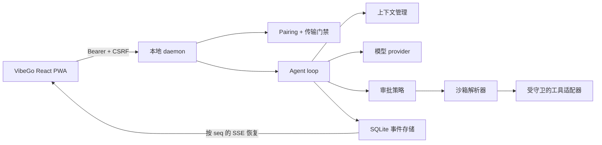

# VibeGo / ready4vibe 中文说明


**一个最小化、优先本地运行的 agent harness，用于远程 Vibe Coding。** VibeGo 让 agent 尽量靠近本地工作区，同时为不可信任务提供明确的审批、沙箱和执行边界，并通过适配桌面、平板和手机的 React 控制台远程观察与继续任务。

[English README](README.md)

> **项目状态：** 早期实现阶段。contracts、可恢复事件日志、调度器、模型/上下文边界、策略/沙箱守卫、单用户 pairing、LAN TLS MVP 和响应式 Web/PWA 控制台已经实现并通过测试。真实外部 sandbox runtime、MCP/Skill 执行、ACME 自动化和完整审批/diff UI 按阶段推进，当前不会隐式开启。

## 为什么做 VibeGo？

它面向希望从另一块屏幕继续本地 coding 任务的单用户开发者，同时避免把工作站变成没有边界的远程 shell。



核心流程保持短而明确：

1. 使用短时有效的本地 pairing code 连接浏览器。
2. 提交带有 workspace、信任级别、sandbox、审批模式和限制的 run。
3. 通过可恢复 SSE 观察模型增量、调度状态、工具决策和终态事件。
4. daemon 默认只绑定 loopback；局域网访问必须显式启用，并默认要求证书。

## 当前能力

| 领域 | 当前包含 |
| --- | --- |
| Runtime | Node.js daemon、可恢复 run 状态、SQLite 事件存储、有界调度、取消 |
| 模型 | OpenAI-compatible provider 边界和可确定测试的 fake provider |
| 上下文 | 带来源标签的上下文管理、预算/压缩边界 |
| 安全 | 不可信任务必须 external sandbox、路径/argv 守卫、审批策略元数据 |
| 工具 | filesystem/shell 适配器和统一 executor；默认不启用主机执行 |
| 访问 | 单用户 pairing、哈希 token、TTL/撤销、Origin/CSRF、禁止 query token |
| 传输 | 默认 loopback HTTP；LAN 显式开启且无证书时 fail-closed；明文仅可显式开发例外 |
| Web | React 19 + TypeScript + Vite 响应式控制台：pairing、run composer、取消、指标和 SSE |

## 快速开始

要求：Node.js `>=22.12.0`、pnpm `11.9.0`。

```powershell
pnpm install
pnpm typecheck
pnpm test

# 开发 Web 控制台
pnpm --filter @ready4vibe/web dev

# 构建并启动 daemon（仅 loopback）
pnpm build
pnpm --filter @ready4vibe/daemon start
```

默认地址是 `http://127.0.0.1:8787`。Web 控制台默认可以 same-origin 访问，也为后续 Tailscale/SSH tunnel 预留 API base URL。

## LAN 与公网访问边界

局域网绑定必须显式开启，且默认强制 TLS：

```powershell
$env:READY4VIBE_HOST = '0.0.0.0'
$env:READY4VIBE_ALLOW_LAN = '1'
$env:READY4VIBE_TLS_CERT_FILE = 'C:\path\to\fullchain.pem'
$env:READY4VIBE_TLS_KEY_FILE = 'C:\path\to\privatekey.pem'
pnpm --filter @ready4vibe/daemon start
```

证书 SAN 必须覆盖客户端实际访问的域名/IP。VibeGo 在启动时校验证书/私钥匹配关系，绝不把 PEM 内容写入日志、health、事件或浏览器。`READY4VIBE_ALLOW_INSECURE_LAN=1` 只是明确的开发环境例外，不会关闭 pairing、Bearer、CSRF 或 query token 禁止规则。

ACME/Let's Encrypt 签发续期、Windows 证书存储和反向代理方案会作为后续 adapter，不在启动时隐式联网。

## 安全模型摘要

- Web token 只在内存中保存，不进入 localStorage、cookie、URL、事件或 telemetry。
- 不可信内容不能静默选择 host adapter；外部 sandbox 不可用时 fail-closed。
- shell 参数、路径、symlink、环境变量传播和输出限制均有专门测试。
- health 只是传输/存储摘要，不代表模型、sandbox 或工具已经安全可用。

## 仓库结构

```text
apps/daemon       HTTP(S) API、认证门禁、run manager、SSE
apps/web          React + TypeScript 响应式控制台
packages/contracts / storage / scheduler
packages/agent / context / model-openai
packages/policy / sandbox / execution / tool-adapters
packages/auth / certificates / testkit
```

## 开发约束

每个实质模块都要先有 spec，再加入单元测试、typecheck 和文档更新，最后用独立 Git 提交。当前基线是 **16 个 workspace package、97 项测试全部通过**。详见 [`docs/implementation-status.md`](docs/implementation-status.md)、[`docs/roadmap.md`](docs/roadmap.md) 和 [`docs/specs/`](docs/specs/)。

品牌采用 VibeGo：深海军蓝背景、青色/靛蓝/紫色强调色，以及代表安全信号的荧光绿。Web 使用的标志位于 [`apps/web/public/vibego-mark.svg`](apps/web/public/vibego-mark.svg)。

## 延伸阅读

- [产品范围](docs/product-brief.md) 与 [总体架构](docs/architecture.md)
- [开源项目调研](docs/open-source-research.md) 与 [harness 合约](docs/harness-contracts.md)
- [安全默认值](docs/adr/0002-security-defaults.md) 与 [LAN/Codex-like 审批决策](docs/adr/0003-lan-access-and-codex-like-approval.md)
- [实施状态](docs/implementation-status.md)、[路线图](docs/roadmap.md) 与 [Spec 索引](docs/specs/)

## 后续路线

- 真实 external sandbox runtime 与资源限制；
- Skill/MCP manifest 和 secret-safe 工具 allowlist；
- diff/log/approval UI 与桌面/平板/手机 Playwright 流程；
- ACME/certificate manager、Tailscale/SSH transport adapter；
- 低资源实测、事件保留、备份导出和第三方 provider/tool SDK。

## 贡献

从一个 spec 或 issue 级边界开始，保持模块化，先补测试再接入副作用，提交前更新文档并执行：

```powershell
pnpm typecheck
pnpm test
pnpm diff:check
```

不要提交 API key、私有证书、workspace secret 或运行时数据。
