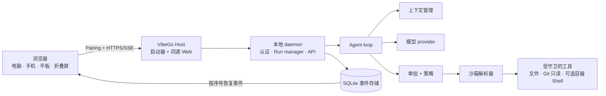

# VibeGo

<p align="center">
  
</p>

<p align="center">
  <strong>在本地运行的 coding agent，从任何浏览器访问。</strong><br />
  让 agent 靠近你的工作区，并从电脑、手机、平板或折叠屏继续同一个对话。
</p>

<p align="center">
  <a href="#快速开始">快速开始</a> ·
  <a href="#默认安全边界">安全边界</a> ·
  <a href="README.md">English README</a>
</p>

<p align="center">
  <em>早期体验 · 单用户 · 本地优先 · 持续完善首个公开发行版本</em>
</p>

VibeGo 是一个面向开发者的轻量 Agent 应用。它不把你的 coding 工作区
变成没有边界的云端 Shell，而是让 daemon 靠近本地代码运行，再通过
以对话为中心的 Web 控制台，让你启动、观察、审批、取消和恢复任务。

## 为什么是 VibeGo？

- **工作区留在身边。** Agent 运行在拥有项目文件的开发电脑上，不要求
  你再搭建一套远程 coding 环境。
- **一个对话，任意屏幕。** 电脑、竖屏显示器、手机、平板和折叠屏都使用
  同一套响应式控制台。
- **不确定的任务默认有边界。** 审批、路径守卫、沙箱、workspace 边界和
  输出限制都属于一次 run 的安全边界。
- **通过设置界面完成配置。** 模型、workspace、权限和运行限制在经过认证
  的 Web Settings 中配置，不需要先研究配置文件。

## 架构总览

用户看到的是一个 Web 控制台；实际执行边界仍然留在本地开发电脑上。
浏览器只接收有界、可恢复的运行事件，不直接运行 Agent，也不直接接触
本地工作区。



用实际使用流程来说：

1. Host 启动本地 daemon 和编译后的 Web 控制台。
2. 你在 Settings 中配对浏览器并选择 workspace。
3. Agent loop 在上下文和运行限制内调用选定的模型。
4. 工具调用必须经过策略、审批、workspace 和沙箱边界。
5. 浏览器接收可恢复的进度和终态事件；Agent 不在浏览器中运行。

## 现在可以用什么？

VibeGo 正在持续完善首个可安装版本。现在已经可以体验本地运行、浏览器对话和
安全边界；发行包和更广泛的部署验证也在同步推进。

| 状态 | 含义 |
| --- | --- |
| **现在可以体验** | 本地 daemon、React Web 控制台、pairing、模型设置、workspace 选择、对话式 run、流式事件与恢复、取消、审批卡片、恢复重试、LAN/TLS 门禁、受守卫的文件/Git 只读路径和有界容器 Shell wiring。 |
| **正在完善** | DeepSeek provider 专属 search/reasoning 兼容性、完整 Goal Control 流程、TencentDB memory sidecar promotion，以及跨平台 external sandbox 证据。 |
| **后续路线** | 签名安装包、升级/回滚、ACME 和系统证书管理、Tailscale/SSH 适配器、原生移动端，以及更完整的真实设备和无障碍验证。 |

## 快速开始

### 当前源码路径

要求：Node.js `>=22.12.0` 和 pnpm `11.9.0`。

```powershell
pnpm install
pnpm build
node scripts/host-launcher.mjs --open
```

Host 默认打开 `http://127.0.0.1:8787`。当前先通过源码路径体验完整流程，
一键签名安装包正在后续发行里程碑中推进。

### 开始第一次对话

1. 打开 Host 显示的地址。
2. 完成一次性 pairing。
3. 打开 **Settings → Model Access**，配置 OpenAI-compatible provider
   或其他已支持的 provider。
4. 打开 **Settings → Workspace**，选择或添加 daemon 所在电脑上的项目目录。
5. 点击 **New conversation**，描述任务并发送。
6. 工具执行前查看审批卡片；如果连接中断，可以从同一对话界面取消、重连，
   或在明确确认后重试恢复的 run。

正常使用不需要编辑 `.env`、YAML 或 JSON 配置文件。Provider key 只通过
经过认证的设置操作发送到 daemon，保留在 daemon 进程内存中，不会进入浏览器
存储、URL、事件或日志。

## 默认安全边界

- **默认只监听本机：** daemon 默认绑定 loopback。
- **LAN 显式开启：** 局域网访问必须主动开启，默认要求 TLS，pairing 和请求
  防护仍然保留。
- **不可信任务 fail-closed：** 不可信内容不能静默选择主机工具路径，也不能
  绕过 external sandbox 要求。
- **每个工具都有上限：** 路径、参数、环境变量传播、workspace 根目录、审批、
  超时和输出大小都会经过检查。
- **Secret 不进入浏览器账本：** 凭据、私钥、原始模型响应和完整工具输出不会
  写入浏览器存储、run/Goal 事件或发行包。

详见 [安全默认值](docs/adr/0002-security-defaults.md) 和
[LAN/Codex-like 审批决策](docs/adr/0003-lan-access-and-codex-like-approval.md)。

## 远程访问

| 连接方式 | 默认状态 | 当前边界 |
| --- | --- | --- |
| 同一台电脑 | 开启 | Loopback HTTP/HTTPS + pairing |
| 局域网 | 关闭 | 显式开启，默认要求 TLS，仍必须 pairing |
| 公网 | 随公网部署里程碑推进 | ACME、反向代理和公网运维加固将作为专门适配器逐步提供 |
| Tailscale / SSH | 计划中 | 保留适配器边界，不增加第二套 Agent runtime |

在公网部署和证书门禁完成前，不要直接把 daemon 暴露到 Internet。高级 LAN/TLS
指南会单独说明运维所需的环境变量和证书细节，普通用户不需要先阅读这些内容。

## VibeGo 是什么，不是什么

VibeGo 是一个本地优先、单用户、通过浏览器使用的 coding agent 控制台。
它不是托管式多租户服务，不是编辑器的替代品，也不是无限制的远程 Shell。
浏览器控制的是本地 daemon；workspace、审批、沙箱决策和持久化 run 历史都
保留在 Host 所在的开发电脑上。

## 面向贡献者

项目按模块推进。每个实质性变更都应有明确的 spec 边界、聚焦单元测试、同步
文档和独立 Git 提交。

```powershell
# 单个受影响模块的快速内循环
pnpm check:module -- @ready4vibe/model-openai

# 较大变更交付前的仓库验证
pnpm verify
```

工程细节请查看 [贡献指南](CONTRIBUTING.md)、[总体架构](docs/architecture.md)、
[实施状态](docs/implementation-status.md) 和 [路线图](docs/roadmap.md)。发行就绪
状态与功能实现状态分开管理，详见
[release publishing spec](docs/specs/57-release-publishing-pipeline.md)。

## 文档导航

- [产品简报](docs/product-brief.md)
- [安全默认值](docs/adr/0002-security-defaults.md)
- [Host-first 发行与客户端边界](docs/specs/41-host-first-distribution-and-client-boundary.md)
- [总体架构](docs/architecture.md) · [harness 合约](docs/harness-contracts.md)
- [实施状态](docs/implementation-status.md) · [路线图](docs/roadmap.md)
- [Spec 索引](docs/specs/)
- [English README](README.md)

VibeGo 仍在公开开发中。上面的“现在可以用什么”负责说明当前可用范围，
详细 spec 负责说明约束、证据强度和后续里程碑。
