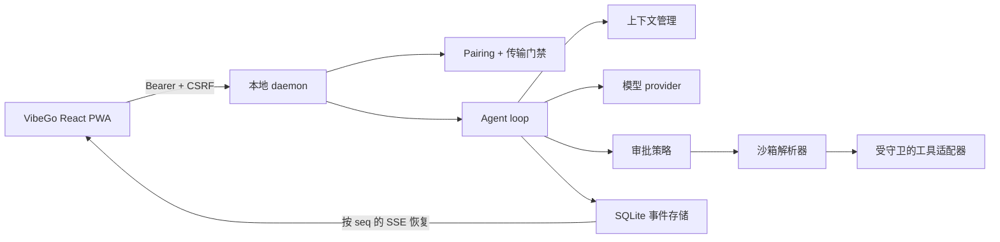

# VibeGo / ready4vibe 中文说明

<p align="center">
  
</p>

**一个最小化、优先本地运行的 agent harness，用于远程 Vibe Coding。** VibeGo 让 agent 尽量靠近本地工作区，同时为不可信任务提供明确的审批、沙箱和执行边界，并通过适配桌面、平板和手机的 React 控制台远程观察与继续任务。

[English README](README.md)

> **项目状态：** 早期实现阶段。contracts、可恢复事件日志、调度器、模型/上下文边界、策略/沙箱守卫、单用户 pairing、LAN TLS MVP、guided workspace registry、Git 只读工具、tool-output inspector、digest 固定的 external shell wiring 和响应式 Web/PWA 控制台已经实现并通过测试。MCP/Skill 激活、ACME 自动化、Git 写入/patch 和完整审批/diff UI 仍按阶段推进，当前不会隐式开启。

## 为什么做 VibeGo？

它面向希望从另一块屏幕继续本地 coding 任务的单用户开发者，同时避免把工作站变成没有边界的远程 shell。



核心流程保持短而明确：

1. 使用短时有效的本地 pairing code 连接浏览器。
2. 提交带有 workspace、信任级别、sandbox、审批模式和限制的 run。
3. 通过可恢复 SSE 观察模型增量、调度状态、工具决策和终态事件。
4. daemon 默认只绑定 loopback；局域网访问必须显式启用，并默认要求证书。

## 当前能力

| 领域 | 当前包含 |
| --- | --- |
| Runtime | Node.js daemon、可恢复 run 状态、SQLite 事件存储、有界调度、取消 |
| 模型 | OpenAI-compatible provider 边界和可确定测试的 fake provider |
| 上下文 | 带来源标签的上下文管理、预算/压缩边界 |
| 安全 | 不可信任务必须 external sandbox、路径/argv 守卫、审批策略元数据 |
| 工具 | filesystem/shell 适配器和统一 executor；默认不启用主机执行 |
| Workspace | 单用户 workspace registry、下拉选择、明确添加/删除确认和 per-run 根目录快照 |
| 访问 | 单用户 pairing、哈希 token、TTL/撤销、Origin/CSRF、禁止 query token |
| 传输 | 默认 loopback HTTP；LAN 显式开启且无证书时 fail-closed；明文仅可显式开发例外 |
| Web | React 19 + TypeScript + Vite 响应式控制台：pairing、workspace 添加/选择向导、引导式设置、模型配置、审批卡片、恢复重试、取消、指标、tool-output inspector 和 SSE |
| Goal Control | Phase 0 原生 TypeScript contracts/projection/claim 守卫，加上 Phase 1 独立 SQLite `goal_events` adapter 与受认证的 daemon 只读 projection/replay；Goal 写操作和默认 run admission 仍关闭 |

## 快速开始

要求：Node.js `>=22.12.0`、pnpm `11.9.0`。

```powershell
pnpm install
pnpm typecheck
pnpm test

# 开发 Web 控制台
pnpm --filter @ready4vibe/web dev

# 构建并启动 daemon（仅 loopback）
pnpm build
pnpm --filter @ready4vibe/daemon start
```

默认地址是 `http://127.0.0.1:8787`。Web 控制台默认可以 same-origin 访问，也为后续 Tailscale/SSH tunnel 预留 API base URL。

控制台内置 Settings 面板，可配置 workspace、模型、任务信任级别、sandbox、审批、网络和运行限制；常规使用不需要手动编辑 `.env` 或 YAML。API key、私钥等 secret 不会进入这个面板，后续由 daemon 侧安全 secret provider 负责。
当传输要求 TLS 时，同一面板还会展示证书有效期和安全的下一步提示，不会要求用户粘贴或上传私钥。

## 模型配置与设置向导

Web 控制台的 Settings 面板包含 Model Access 向导：输入 OpenAI-compatible
服务地址、模型名和 API key 即可完成配置，不需要编辑 `.env` 或 YAML。API key
只通过已认证连接发送到 daemon，成功后会清空浏览器输入框，仅保留在 daemon
进程内存中；它不会写入 localStorage、事件、日志或 URL。daemon 重启后会再次
提示配置，后续再接入 Windows Credential Manager 等系统密钥存储。

Settings 还提供显式的 Filesystem tools 开关。开启后仅注册受路径守卫、审批和
输出上限约束的文件读写工具；shell、MCP、网络和外部 sandbox 不会被隐式启用。
另有独立的 Git read-only tools 开关，仅注册有界的 `git.status`、`git.diff`、
`git.log` 读取；提交、checkout、reset、patch/apply、remote 和任意 Git 参数均
不会注册。设置界面也会引导 Docker/Podman 探测和固定 digest 的外部 shell 配置，
不要求手动编辑配置文件，且 shell 没有主机回退路径。

Workspace 设置使用下拉选择和明确的添加/删除向导。添加路径指 daemon 所在机器
上的目录，必须由用户确认；路径只保留在 daemon 的非 secret 设置与运行时内，不会
回显到状态、事件、日志或浏览器存储，未知 workspace 也不会静默回退到 `default`。

## LAN 与公网访问边界

局域网绑定必须显式开启，且默认强制 TLS：

```powershell
$env:READY4VIBE_HOST = '0.0.0.0'
$env:READY4VIBE_ALLOW_LAN = '1'
$env:READY4VIBE_TLS_CERT_FILE = 'C:\path\to\fullchain.pem'
$env:READY4VIBE_TLS_KEY_FILE = 'C:\path\to\privatekey.pem'
pnpm --filter @ready4vibe/daemon start
```

证书 SAN 必须覆盖客户端实际访问的域名/IP。VibeGo 在启动时校验证书/私钥匹配关系，绝不把 PEM 内容写入日志、health、事件或浏览器。`READY4VIBE_ALLOW_INSECURE_LAN=1` 只是明确的开发环境例外，不会关闭 pairing、Bearer、CSRF 或 query token 禁止规则。

ACME/Let's Encrypt 签发续期、Windows 证书存储和反向代理方案会作为后续 adapter，不在启动时隐式联网。

## 安全模型摘要

- Web token 只在内存中保存，不进入 localStorage、cookie、URL、事件或 telemetry。
- 不可信内容不能静默选择 host adapter；外部 sandbox 不可用时 fail-closed。
- shell 参数、路径、symlink、环境变量传播和输出限制均有专门测试。
- health 只是传输/存储摘要，不代表模型、sandbox 或工具已经安全可用。

## 仓库结构

```text
apps/daemon       HTTP(S) API、认证门禁、run manager、SSE
apps/web          React + TypeScript 响应式控制台
packages/contracts / storage / scheduler
packages/agent / context / model-openai
packages/policy / sandbox / execution / tool-adapters（filesystem/shell/Git）
packages/sandbox-runtime  Docker/Podman 命令计划与 fail-closed CLI runner 边界
packages/workspaces      单用户 workspace id 到 daemon 根目录的安全 registry
packages/auth / certificates / testkit
packages/skill-mcp   严格 Skill/MCP manifest 与默认拒绝的工具投影
packages/goal-control 原生 Goal/Todo/Gate/Evidence 控制平面（Phase 0）
```

## 开发约束

每个实质模块都要先有 spec，再加入单元测试、typecheck 和文档更新，最后用独立 Git 提交。Agent Memory Phase 0 contract/Noop、Phase 1 MemoryCore HTTP adapter、Phase 2 durable settings/status、Phase 3 sidecar supervisor、Phase 4 bounded run integration、Phase 5 显式 MemoryProxy 和只读 MemoryKnowledge adapter、Phase 6a Knowledge settings/probe/新 run context 集成，以及 Phase 6b operations projection/兼容性 fixture 已实现；Knowledge 工具注册和 Proxy sidecar 自动更新仍按阶段推进。详见 [`docs/implementation-status.md`](docs/implementation-status.md)、[`docs/roadmap.md`](docs/roadmap.md) 和 [`docs/specs/`](docs/specs/)。

品牌采用 VibeGo：深海军蓝背景、青色/靛蓝/紫色强调色，以及代表安全信号的荧光绿。Web 使用的标志位于 [`apps/web/public/vibego-mark.svg`](apps/web/public/vibego-mark.svg)。

## 延伸阅读

- [产品范围](docs/product-brief.md) 与 [总体架构](docs/architecture.md)
- [开源项目调研](docs/open-source-research.md) 与 [harness 合约](docs/harness-contracts.md)
- [安全默认值](docs/adr/0002-security-defaults.md) 与 [LAN/Codex-like 审批决策](docs/adr/0003-lan-access-and-codex-like-approval.md)
- [实施状态](docs/implementation-status.md)、[路线图](docs/roadmap.md) 与 [Spec 索引](docs/specs/)

## 后续路线

- 更完整的 external sandbox/VM adapter、资源限制与持久化；
- Skill/MCP manifest 和 secret-safe 工具 allowlist；
- 分页/高亮 diff/log/approval UI 与桌面/平板/手机 Playwright 流程；
- Goal 写 API、Web Goal 投影操作和 governed preflight（Phase 0/1 合同、存储与受认证只读 projection 已完成）；
- ACME/certificate manager、Tailscale/SSH transport adapter；
- 低资源实测、事件保留、备份导出和第三方 provider/tool SDK。

## 贡献

从一个 spec 或 issue 级边界开始，保持模块化，先补测试再接入副作用，提交前更新文档并执行：

```powershell
pnpm typecheck
pnpm test
pnpm diff:check
```

不要提交 API key、私有证书、workspace secret 或运行时数据。
