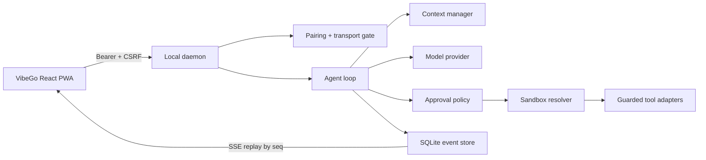
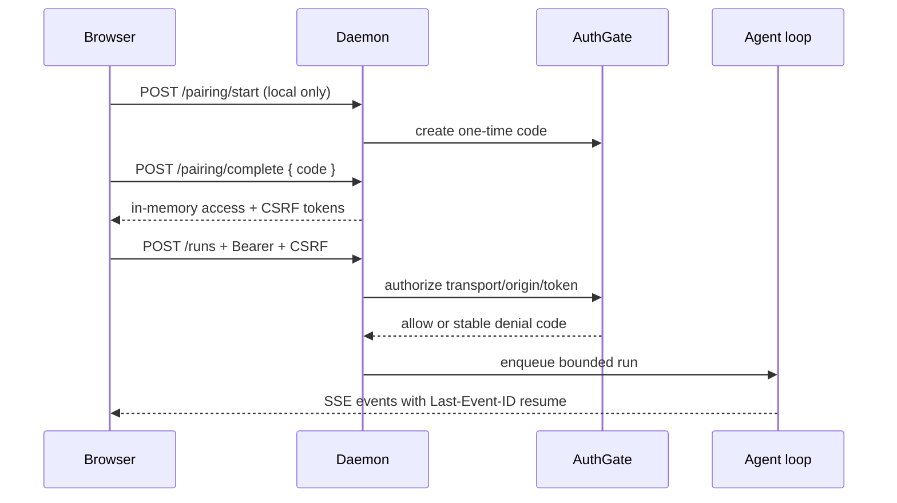

# VibeGo / ready4vibe

<p align="center">
  
</p>

**A minimal, local-first agent harness for remote Vibe Coding.** VibeGo keeps the agent runtime close to your workspace, adds explicit safety boundaries for untrusted work, and exposes a responsive React console for desktop, tablet, and mobile access.

[简体中文说明](README-zh.md)

> **Project status:** early implementation. The contracts, persistent event log, scheduler, model/context boundary, policy/sandbox guards, single-user pairing gate, LAN TLS MVP, guided workspace registry, opt-in Git read-only tools, digest-pinned external shell wiring, and responsive Web/PWA run console are implemented and tested. MCP/Skill activation, ACME automation, Git write/patch operations, and the full approval/diff UI remain staged for later milestones.

## Why VibeGo?

VibeGo is designed for a single developer who wants to continue a local coding task from another screen without turning the workstation into an unbounded remote shell.



The core loop is deliberately small:

1. Pair the browser once with a short-lived local code.
2. Submit a run with an explicit workspace, trust level, sandbox, approval mode, and limits.
3. Observe model deltas, scheduler state, tool decisions, and terminal events through resumable SSE.
4. Keep the daemon bound to loopback by default; opt into LAN only with an explicit setting and TLS certificate pair.

## Current capabilities

| Area | Included now |
| --- | --- |
| Runtime | Node.js daemon, resumable run state, SQLite event store, bounded scheduler, cancellation |
| Models | OpenAI-compatible provider boundary, authenticated Web onboarding, process-memory secret handling, and in-memory fake provider for deterministic tests |
| Context | Source-labelled context manager with budget/compaction boundaries |
| Safety | Untrusted-task external-sandbox requirement, path/argv guards, approval policy metadata |
| Tools | Guarded filesystem read/write, opt-in Git status/diff/log reads, plus opt-in Docker/Podman shell adapters behind a shared executor; host fallback remains disabled |
| Workspaces | Guided single-user registry with safe labels/ids, explicit add/remove confirmation, and per-run root snapshots |
| Access | Single-user pairing, hashed bearer tokens, TTL/revocation, Origin/CSRF checks, query-token rejection |
| Transport | Loopback HTTP by default; LAN opt-in with TLS fail-closed; explicit insecure LAN escape hatch for development |
| Web | React 19 + TypeScript + Vite responsive console with pairing, guided run settings, model onboarding, retry/recovery, approval cards, cancel, metrics, and fetch-based SSE |

## Quick start

Requirements: Node.js `>=22.12.0` and pnpm `11.9.0`.

```powershell
pnpm install
pnpm typecheck
pnpm test

# Start the responsive console during development
pnpm --filter @ready4vibe/web dev

# Build and start the daemon (loopback only)
pnpm build
pnpm --filter @ready4vibe/daemon start
```

The default daemon address is `http://127.0.0.1:8787`. The web console can use same-origin access or a configured API base URL for a future Tailscale/SSH tunnel.

The console includes a Settings panel for workspace, model, trust, sandbox,
approval, network, and run limits. These choices are sent as a validated run
profile; normal setup does not require editing `.env` or YAML files. The Model
Access card accepts an OpenAI-compatible provider URL and API key over the
authenticated channel; the key is write-only, kept in daemon memory, and never
placed in browser storage, events, logs, or URLs. Web-configured keys are
cleared when the daemon restarts until an OS keyring adapter is enabled. When
TLS is required, the same panel shows certificate validity and safe next-step
guidance without asking the user to paste or upload a private key.

The same Settings panel has an explicit Filesystem tools toggle. It exposes
only bounded read/write adapters for the daemon workspace; writes still use the
approval flow, and shell/MCP/network tools are not silently enabled. A separate
Git read-only toggle exposes only bounded `git.status`, `git.diff`, and `git.log`
for trusted host-workspace runs; commits, remotes, patch writes, and arbitrary
Git flags are not registered.
Workspace setup replaces the free-form workspace id with a guided selector and
an explicit add/remove flow. Added paths are on the daemon machine and remain
process-memory only; they are never echoed into status, events, logs, or browser
storage. Docker/Podman capability probing and digest-pinned external shell are
also enabled from this Settings panel, without hand-edited configuration files.

## LAN and public-access boundary

LAN binding is opt-in and TLS is required by default:

```powershell
$env:READY4VIBE_HOST = '0.0.0.0'
$env:READY4VIBE_ALLOW_LAN = '1'
$env:READY4VIBE_TLS_CERT_FILE = 'C:\path\to\fullchain.pem'
$env:READY4VIBE_TLS_KEY_FILE = 'C:\path\to\privatekey.pem'
pnpm --filter @ready4vibe/daemon start
```

The certificate must cover the hostname/IP clients use (SAN). VibeGo validates the certificate/private-key pair at startup and never puts PEM contents into logs, health responses, events, or the browser. `READY4VIBE_ALLOW_INSECURE_LAN=1` is an explicit development-only exception; it does not disable pairing, bearer authentication, CSRF, or query-token rejection.

ACME/Let's Encrypt issuance, Windows certificate-store integration, and reverse-proxy recipes are planned adapters rather than implicit network behavior.

## Security model at a glance



- Tokens are held in memory only by the Web client; they are not stored in localStorage, cookies, URLs, events, or telemetry.
- Untrusted content cannot silently select a host adapter; the resolver requires an external sandbox mode and fails closed when unavailable.
- Shell arguments, paths, symlinks, environment propagation, and output limits have focused tests.
- Health is a transport/storage summary, not proof that a model, sandbox, or tool is safe to use.

## Repository map

```text
apps/
  daemon/       HTTP(S) API, auth gate wiring, run manager, SSE
  web/          React + TypeScript responsive console
packages/
  contracts/    Zod contracts and run/event state validation
  storage/      in-memory and SQLite event stores
  scheduler/    bounded concurrency and workspace leases
  agent/        deterministic loop orchestration boundary
  context/      context sources, budgets, and compaction boundary
  model-openai/ OpenAI-compatible provider adapter
  policy/       approval decisions and risk metadata
  sandbox/      external-sandbox resolver and input guards
  execution/    path/argv verification primitives
  sandbox-runtime/ Docker/Podman command plans and fail-closed CLI runner boundary
  tool-adapters/ filesystem/shell/Git executor adapters
  workspaces/    safe single-user workspace id to daemon-root registry
  auth/         pairing, token, Origin/CSRF, and transport gate
  certificates/ PEM pair resolution and TLS validation
  skill-mcp/    strict Skill/MCP manifests and default-deny tool projection
  testkit/      fake providers, clocks, and event assertions
```

## Development discipline

Every substantive module is introduced with a spec, unit tests, typecheck coverage, and a focused Git commit. The current baseline is **19 workspace packages and 185 passing tests**. See [`docs/implementation-status.md`](docs/implementation-status.md), [`docs/roadmap.md`](docs/roadmap.md), and [`docs/specs/`](docs/specs/) for the constraints and staged work.

Brand direction is VibeGo: a dark navy canvas, cyan/indigo/violet accents, and a lime safety signal. The mark used by the Web app is [`apps/web/public/vibego-mark.svg`](apps/web/public/vibego-mark.svg).

## Further reading

- [Product brief](docs/product-brief.md) and [architecture](docs/architecture.md)
- [Open-source research](docs/open-source-research.md) and [harness contracts](docs/harness-contracts.md)
- [Security defaults](docs/adr/0002-security-defaults.md) and [LAN/Codex-like approval decisions](docs/adr/0003-lan-access-and-codex-like-approval.md)
- [Implementation status](docs/implementation-status.md), [roadmap](docs/roadmap.md), and [spec index](docs/specs/)

## Roadmap highlights

- deeper external sandbox/VM adapters with resource limits and persistence;
- Git write/patch operations and a dedicated paginated diff/log explorer;
- Skill/MCP manifest and transport adapters with secret-safe tool allowlists;
- diff/log/approval views and Playwright desktop/tablet/mobile flows;
- ACME/certificate manager adapter and Tailscale/SSH transport adapters;
- low-resource measurements, event retention, backup/export, and third-party provider/tool SDKs.

## Contributing

Start with a spec or an issue-sized boundary, keep the change modular, add tests before wiring new side effects, update the relevant documentation before committing, and run:

```powershell
pnpm typecheck
pnpm test
pnpm diff:check
```

Do not commit API keys, private certificates, workspace secrets, or generated runtime data.
