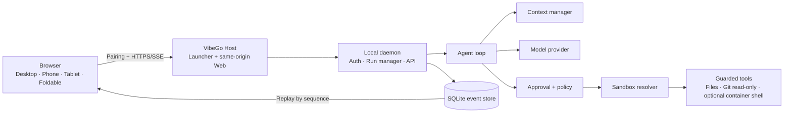

# VibeGo

<p align="center">
  
</p>

<p align="center">
  <strong>Your local coding agent, available from any browser.</strong><br />
  Run the agent next to your workspace and continue the same conversation from a laptop, phone, tablet, or foldable device.
</p>

<p align="center">
  <a href="#get-started">Get started</a> ·
  <a href="#security-by-default">Security</a> ·
  <a href="README-zh.md">中文说明</a>
</p>

<p align="center">
  <em>Early access · Single-user · Local-first · Building toward the first public release</em>
</p>

VibeGo is a lightweight agent app for developers who want remote control
without moving their coding workspace into an unbounded cloud shell. The
daemon stays close to your files, while the Web console gives you a
conversation-first way to start, observe, approve, cancel, and recover work.

## Why VibeGo?

- **Your workspace stays nearby.** The agent runs on the computer that owns the
  project instead of requiring a second remote coding environment.
- **One conversation, any screen.** Use the same responsive console from a
  desktop, portrait monitor, phone, tablet, or foldable browser.
- **Safe defaults for uncertain work.** Approval, path guards, sandbox rules,
  workspace boundaries, and output limits are part of the run—not an afterthought.
- **Settings instead of config archaeology.** Model access, workspace choices,
  permissions, and run limits are configured from the authenticated Web UI.

## Architecture at a glance

The user sees one Web console. Behind it, VibeGo keeps the execution boundary
on the local development computer and sends only bounded, resumable run events
back to the browser.



In practical terms:

1. The Host starts the local daemon and the compiled Web console.
2. You pair a browser and choose a workspace in Settings.
3. The Agent loop calls the selected model within the context and run limits.
4. Tools pass through policy, approval, workspace, and sandbox boundaries.
5. The browser receives resumable progress and terminal events; it never needs
   to run the agent itself.

## Can I use it now?

VibeGo is evolving toward its first installable release. You can already try
the local workflow, the browser conversation experience, and its safety
boundaries while release packaging and broader deployment validation continue
in parallel.

| Status | What it means |
| --- | --- |
| **Available now** | Local daemon, React Web console, pairing, model setup, workspace selector, conversation runs, streaming/replay, cancellation, approval cards, recovery retry, LAN/TLS gate, guarded filesystem/Git-read-only paths, and bounded container-shell wiring. |
| **In progress** | DeepSeek provider-specific search/reasoning compatibility, complete Goal Control workflows, TencentDB memory sidecar promotion, and cross-platform external-sandbox evidence. |
| **On the roadmap** | Signed installers, upgrade/rollback, ACME and OS certificate managers, Tailscale/SSH adapters, native mobile clients, and broader device/accessibility validation. |

## Get started

### One-click start (Windows)

Double-click **`start-vibego.bat`** in the repository root. It finds a Node.js
runtime — a portable copy under `.ready4vibe/runtime`, one already installed
on `PATH`, or an official Node.js LTS zip it downloads into
`.ready4vibe/runtime` — then installs dependencies, builds the workspace when
needed, starts the Host and opens the console. Nothing is installed
system-wide and all state stays inside the repository. `Ctrl+C` stops the
Host. The same flow is available on any platform as `pnpm launch`.

### Source checkout (manual path)

Requirements: Node.js `>=22.12.0` and pnpm `11.9.0`.

```powershell
pnpm install
pnpm build
node scripts/host-launcher.mjs --open
```

The Host opens the local console at `http://127.0.0.1:8787` unless an explicit
port is selected. This is the source-based path while the signed, one-click
installer is being prepared.

### Start your first conversation

1. Open the URL shown by the Host.
2. Complete the one-time pairing flow.
3. Open **Settings → Model Access** and configure an OpenAI-compatible provider
   or another supported provider.
4. Open **Settings → Workspace** and select or add the project directory on the
   daemon computer.
5. Choose **New conversation**, describe the task, and send it.
6. Review approval cards before a guarded tool runs. You can cancel, reconnect,
   or explicitly retry a recovered run from the same conversation surface.

Normal setup does not require editing `.env`, YAML, or JSON files. Provider keys
are sent through the authenticated setup action, kept in daemon process memory,
and are not placed in browser storage, URLs, events, or logs.

## Security by default

- **Loopback first:** the daemon binds to the local computer by default.
- **LAN is opt-in:** remote LAN access requires an explicit setting and TLS by
  default; pairing and request protections remain enabled.
- **Untrusted work fails closed:** untrusted content cannot silently select a
  host tool path or bypass the external-sandbox requirement.
- **Every tool is bounded:** paths, arguments, environment propagation,
  workspace roots, approval decisions, timeouts, and output sizes are checked.
- **Secrets stay out of the UI ledger:** credentials, private keys, raw model
  responses, and full tool output are not written to browser storage, run/Goal
  events, or release artifacts.

See the [security defaults](docs/adr/0002-security-defaults.md) and
[LAN access decisions](docs/adr/0003-lan-access-and-codex-like-approval.md) for
the detailed boundaries.

## Remote access

| Connection | Default | Current boundary |
| --- | --- | --- |
| Same computer | Enabled | Loopback HTTP/HTTPS with pairing |
| Local network | Disabled | Explicit opt-in, TLS required by default, pairing still required |
| Public Internet | Follows the public-deployment milestones | ACME, reverse-proxy, and operational hardening are being delivered as dedicated adapters |
| Tailscale / SSH | Planned | Reserved adapter boundary; no second agent runtime |

Do not expose the daemon directly to the Internet until the public-deployment
and certificate gates are complete. The advanced LAN/TLS guide contains the
operator-only environment and certificate details.

## What VibeGo is—and is not

VibeGo is a local-first, single-user browser console for a coding agent. It is
not a hosted multi-tenant service, not a replacement for your editor, and not
an unrestricted remote shell. The browser controls a daemon that keeps the
workspace, approvals, sandbox decisions, and durable run history on the host
computer.

## For contributors

The project is developed module by module. Each substantive change is expected
to have a spec boundary, focused unit tests, synchronized documentation, and an
independent Git commit.

```powershell
# Fast inner loop for one affected module
pnpm check:module -- @ready4vibe/model-openai

# Repository verification before a larger handoff
pnpm verify
```

Use the [contributing guide](CONTRIBUTING.md), [architecture](docs/architecture.md),
[implementation status](docs/implementation-status.md), and [roadmap](docs/roadmap.md)
for engineering details. Release readiness is tracked separately from feature
implementation; see the [release publishing spec](docs/specs/57-release-publishing-pipeline.md).

## Documentation

- [Product brief](docs/product-brief.md)
- [Security defaults](docs/adr/0002-security-defaults.md)
- [Host-first distribution boundary](docs/specs/41-host-first-distribution-and-client-boundary.md)
- [Architecture and harness contracts](docs/architecture.md) · [harness contracts](docs/harness-contracts.md)
- [Implementation status](docs/implementation-status.md) · [roadmap](docs/roadmap.md)
- [Spec index](docs/specs/)
- [中文 README](README-zh.md)

VibeGo is still being built in public. Treat the status section above as the
source of truth for what is usable today, and treat the detailed specs as the
source of truth for constraints and future milestones.
