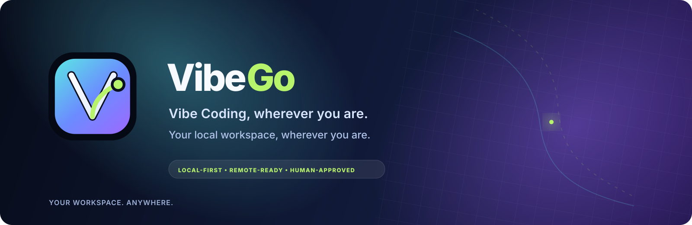
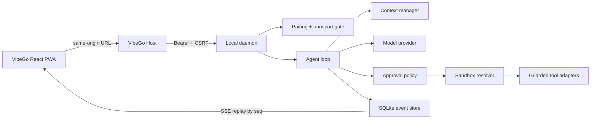
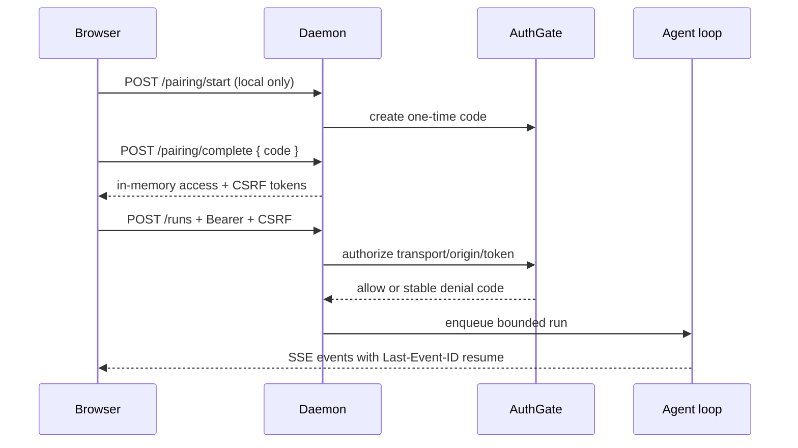

# VibeGo / ready4vibe

<p align="center">
  
</p>

**A minimal, local-first agent harness for remote Vibe Coding.** VibeGo keeps the agent runtime close to your workspace, adds explicit safety boundaries for untrusted work, and exposes a responsive React console for desktop, tablet, and mobile access.

[简体中文说明](README-zh.md)

> **Project status:** early implementation. The contracts, persistent event log, scheduler, model/context boundary, policy/sandbox guards, single-user pairing gate, LAN TLS MVP, guided workspace registry, opt-in Git read-only tools, digest-pinned external shell wiring, responsive Web/PWA run console, Host-first Web dist (Spec 51-R1), dependency-free launcher lifecycle (Spec 51-R2), certificate readiness projection (Spec 51-R3a), versioned REST/SSE client SDK (Spec 51-R4), strict Host manifest/update-state contracts (Spec 53 Phase 0/1), model onboarding contracts, explicit OpenAI-compatible model probe, authenticated daemon probe route (Spec 54 Phase 0/1/2), and the DeepSeek capability/snapshot plus bounded provider-owned search application port (Spec 61-7/61-9) are implemented and tested. Live DeepSeek search/reasoning compatibility, the signed release bundle, ACME/OS certificate automation, OS keychain adapters, MCP/Skill activation, Git write/patch operations, full approval/diff UI, and native Android/iOS/HarmonyOS clients remain staged for later milestones.

## Why VibeGo?

VibeGo is designed for a single developer who wants to continue a local coding task from another screen without turning the workstation into an unbounded remote shell.



The core loop is deliberately small:

1. Pair the browser once with a short-lived local code.
2. Submit a run with an explicit workspace, trust level, sandbox, approval mode, and limits.
3. Observe model deltas, scheduler state, tool decisions, and terminal events through resumable SSE.
4. Keep the daemon bound to loopback by default; opt into LAN only with an explicit setting and TLS certificate pair.

## Current capabilities

| Area | Included now |
| --- | --- |
| Runtime | Node.js daemon, resumable run state, SQLite event store, bounded scheduler, cancellation |
| Models | OpenAI-compatible and opt-in DeepSeek provider boundaries, capability snapshots, authenticated Web onboarding, process-memory secret handling, and deterministic fake providers |
| Context | Source-labelled context manager with budget/compaction boundaries |
| Safety | Untrusted-task external-sandbox requirement, path/argv guards, approval policy metadata |
| Tools | Guarded filesystem read/write, opt-in Git status/diff/log reads, plus opt-in Docker/Podman shell adapters behind a shared executor; host fallback remains disabled; digest-pinned container smoke is explicit |
| Workspaces | Guided single-user registry with safe labels/ids, explicit add/remove confirmation, daemon-local non-secret persistence, and per-run root snapshots |
| Access | Single-user pairing, hashed bearer tokens, TTL/revocation, Origin/CSRF checks, query-token rejection |
| Transport | Loopback HTTP by default; LAN opt-in with TLS fail-closed; explicit insecure LAN escape hatch for development |
| Web | React 19 + TypeScript + Vite responsive console with pairing, guided onboarding/settings, model setup, retry/recovery, approval cards, bounded tool-output inspector, cancel, metrics, and fetch-based SSE; production same-origin Host serving is implemented |
| Goals | Phase 0 native TypeScript Goal Control contracts/projection/claim guards plus Phase 1 isolated SQLite `goal_events` adapter and authenticated read-only daemon projection/replay; Goal writes and default run admission remain disabled |

## Quick start

Requirements: Node.js `>=22.12.0` and pnpm `11.9.0`.

```powershell
pnpm install
pnpm typecheck
pnpm test

# Start the responsive console during development (Vite + daemon are separate in the source checkout)
pnpm --filter @ready4vibe/web dev

# Build and start the daemon (loopback only)
pnpm build
pnpm --filter @ready4vibe/daemon start

# Optional local Docker/Podman smoke (digest required; never pulls an image)
pnpm smoke:container -- --runtime docker --image ghcr.io/example/runner@sha256:<64-hex-digest>

# Optional explicit live model smoke (key stays in this process environment)
$env:READY4VIBE_MODEL_API_KEY = '<out-of-band-key>'
pnpm smoke:model -- --endpoint https://api.deepseek.com/chat/completions --model deepseek-v4-flash --secret-env READY4VIBE_MODEL_API_KEY
```

`pnpm smoke:model` is opt-in and outside `pnpm verify`. It makes one bounded
OpenAI-compatible request, prints only a redacted status/latency/usage report,
and never writes the key, endpoint, prompt, raw response, or report to the
repository, daemon events, logs, or browser storage. Use a complete provider
endpoint; a base URL without `/chat/completions` is intentionally rejected.

The provider-owned search application port has a deterministic, no-network
fixture. It exercises the explicit Responses snapshot, network/approval gate,
bounded untrusted retrieval mapping, malformed response handling, and
cancellation without requiring a key:

```bash
pnpm smoke:deepseek-search
```

This fixture is not live-provider evidence; real DeepSeek `web_search`
compatibility remains a separately gated milestone.

The default daemon address is `http://127.0.0.1:8787`. This is the contributor/development
path. When `pnpm build` has produced `apps/web/dist`, the daemon serves the compiled Web,
API and SSE on one same-origin Host URL; `READY4VIBE_WEB_DIST_DIR` can point to another
absolute dist directory. The development launcher is `node scripts/host-launcher.mjs`; a
signed, Node-free release bundle remains a later Spec 53/57 deliverable.

## Host-first deployment target

The intended user workflow is to install one VibeGo Host package on the development computer.
The Host starts the Node daemon, SQLite and compiled React Web together, then opens one URL.
Remote users on another desktop, phone, tablet or foldable only open that URL; they do not
install Node, pnpm or a second backend. LAN is opt-in and TLS/pairing remain mandatory gates.

Android, iOS and HarmonyOS native clients are explicitly later work. They will consume the
same versioned REST/SSE and device-session contracts instead of running a local AgentLoop or
reading Host storage. See [Spec 41](docs/specs/41-host-first-distribution-and-client-boundary.md)
and [ADR 0010](docs/adr/0010-host-first-same-origin-web-and-client-boundary.md).

The console includes a Settings panel for workspace, model, trust, sandbox,
approval, network, and run limits. These choices are sent as a validated run
profile; normal setup does not require editing `.env` or YAML files. The Model
Access card accepts an OpenAI-compatible provider URL and API key over the
authenticated channel; the key is write-only, kept in daemon memory, and never
placed in browser storage, events, logs, or URLs. Web-configured keys are
cleared when the daemon restarts until an OS keyring adapter is enabled. When
TLS is required, the same panel shows certificate validity and safe next-step
guidance without asking the user to paste or upload a private key.

The same Settings panel has an explicit Filesystem tools toggle. It exposes
only bounded read/write adapters for the daemon workspace; writes still use the
approval flow, and shell/MCP/network tools are not silently enabled. A separate
Git read-only toggle exposes only bounded `git.status`, `git.diff`, and `git.log`
for trusted host-workspace runs; commits, remotes, patch writes, and arbitrary
Git flags are not registered.
Workspace setup replaces the free-form workspace id with a guided selector and
an explicit add/remove flow. Added paths are on the daemon machine and are
persisted only as a validated, non-secret daemon setting; they are never echoed
into status, events, logs, or browser storage. Docker/Podman capability probing and digest-pinned external shell are
also enabled from this Settings panel, without hand-edited configuration files.

## LAN and public-access boundary

LAN binding is opt-in and TLS is required by default:

```powershell
$env:READY4VIBE_HOST = '0.0.0.0'
$env:READY4VIBE_ALLOW_LAN = '1'
$env:READY4VIBE_TLS_CERT_FILE = 'C:\path\to\fullchain.pem'
$env:READY4VIBE_TLS_KEY_FILE = 'C:\path\to\privatekey.pem'
pnpm --filter @ready4vibe/daemon start
```

The certificate must cover the hostname/IP clients use (SAN). VibeGo validates the certificate/private-key pair at startup and never puts PEM contents into logs, health responses, events, or the browser. `READY4VIBE_ALLOW_INSECURE_LAN=1` is an explicit development-only exception; it does not disable pairing, bearer authentication, CSRF, or query-token rejection.

ACME/Let's Encrypt issuance, Windows certificate-store integration, and reverse-proxy recipes are planned adapters rather than implicit network behavior.

## Security model at a glance



- Tokens are held in memory only by the Web client; they are not stored in localStorage, cookies, URLs, events, or telemetry.
- Untrusted content cannot silently select a host adapter; the resolver requires an external sandbox mode and fails closed when unavailable.
- Shell arguments, paths, symlinks, environment propagation, and output limits have focused tests.
- Health is a transport/storage summary, not proof that a model, sandbox, or tool is safe to use.

## Repository map

```text
apps/
  daemon/       HTTP(S) API, auth gate wiring, run manager, SSE
  web/          React + TypeScript responsive console
packages/
  contracts/    Zod contracts, run/event validation, release and onboarding boundaries
  client-sdk/   versioned REST/SSE client with pairing, replay and degraded projections
  storage/      in-memory and SQLite event stores
  scheduler/    bounded concurrency and workspace leases
  agent/        deterministic loop orchestration boundary
  context/      context sources, budgets, and compaction boundary
  model-openai/ OpenAI-compatible provider adapter
  model-deepseek/ DeepSeek protocol, capability, and bounded search adapter
  policy/       approval decisions and risk metadata
  sandbox/      external-sandbox resolver and input guards
  execution/    path/argv verification primitives
  sandbox-runtime/ Docker/Podman command plans and fail-closed CLI runner boundary
  tool-adapters/ filesystem/shell/Git executor adapters
  workspaces/    safe single-user workspace id to daemon-root registry
  auth/         pairing, token, Origin/CSRF, and transport gate
  certificates/ PEM pair resolution and TLS validation
  skill-mcp/    strict Skill/MCP manifests and default-deny tool projection
  goal-control/ native Goal/Todo/Gate/Evidence control plane (Phase 0)
  testkit/      fake providers, clocks, and event assertions
```

## Development discipline

Every substantive module is introduced with a spec, unit tests, typecheck coverage, and a focused Git commit. Agent Memory Phase 0 contracts/Noop, the Phase 1 MemoryCore HTTP adapter, the Phase 2 durable settings/status boundary, the Phase 3 sidecar supervisor, the Phase 4 bounded run integration, the Phase 5 explicit MemoryProxy and read-only MemoryKnowledge adapters, Phase 6a Knowledge settings/probe/new-run context integration, and the Phase 6b operations projection/compatibility fixtures are implemented; Knowledge tool registration and automatic Proxy sidecar updates remain staged work. See [`docs/implementation-status.md`](docs/implementation-status.md), [`docs/roadmap.md`](docs/roadmap.md), and [`docs/specs/`](docs/specs/) for the constraints and staged work.

Brand direction is VibeGo: a dark navy canvas, cyan/indigo/violet accents, and a lime safety signal. The mark used by the Web app is [`apps/web/public/vibego-mark.svg`](apps/web/public/vibego-mark.svg).

## Further reading

- [Product brief](docs/product-brief.md) and [architecture](docs/architecture.md)
- [Open-source research](docs/open-source-research.md) and [harness contracts](docs/harness-contracts.md)
- [Security defaults](docs/adr/0002-security-defaults.md) and [LAN/Codex-like approval decisions](docs/adr/0003-lan-access-and-codex-like-approval.md)
- [Implementation status](docs/implementation-status.md), [roadmap](docs/roadmap.md), and [spec index](docs/specs/)
- [Host-first distribution and future client boundary](docs/specs/41-host-first-distribution-and-client-boundary.md) and [ADR 0010](docs/adr/0010-host-first-same-origin-web-and-client-boundary.md)

## Roadmap highlights

- deeper external sandbox/VM adapters with resource limits and persistence;
- Git write/patch operations and a dedicated paginated diff/log explorer;
- Skill/MCP manifest and transport adapters with secret-safe tool allowlists;
- paginated/highlighted diff/log/approval views and Playwright desktop/tablet/mobile flows;
- Goal write APIs, Web Goal projection actions, and governed preflight after the native Phase 0/1 contracts, storage, and authenticated read-only projection slice;
- ACME/certificate manager adapter and Tailscale/SSH transport adapters;
- Host-first same-origin static Web serving, cross-platform launcher/release packages, and signed update/rollback;
- OS keychain adapters and the next Spec 54 onboarding integration slice;
- Android/iOS/HarmonyOS native clients after the Host/API/SSE contracts stabilize;
- low-resource measurements, event retention, backup/export, and third-party provider/tool SDKs.

## Contributing

Start with a spec or an issue-sized boundary, keep the change modular, add tests before wiring new side effects, update the relevant documentation before committing, and run:

```powershell
# Inner loop: build dependencies, then typecheck/test only the changed package.
pnpm check:module -- @ready4vibe/model-openai

# Full pre-commit gate.
pnpm typecheck
pnpm test
pnpm diff:check
pnpm verify
```

Do not commit API keys, private certificates, workspace secrets, or generated runtime data.
