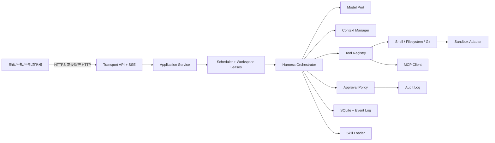

# 总体架构

**状态：Accepted（实现基线；workspace registry、Web 设置和显式 tool runtime 已落地）**

## 分层



## 进程模型

- `apps/daemon`：Node.js 单进程；负责 API、任务调度、harness、存储、workspace registry 和显式启用的工具 runtime。
- `apps/web`：React/Vite 静态构建；开发时独立运行，生产时由 daemon 静态托管或由反代托管。
- 可选 `sandbox-worker`：仅在启用 Docker/VM/平台隔离时出现；MVP 不强制常驻。
- 模型服务、MCP server、Docker/VM 均是外部进程，不进入 daemon 的核心内存模型。
- Scheduler 默认允许 2 个 active run；provider、tool、sandbox 和 workspace write lease 共同决定实际并发。

## 推荐 monorepo

```text
apps/
  daemon/                 # Node.js + TypeScript 本地服务
  web/                    # React + TypeScript + Vite/PWA
packages/
  contracts/              # Zod schema、事件、API、版本常量
  harness/                # run/turn/step 状态机与取消
  model/                  # ModelProvider、流式响应、重试和预算
  context/                # 消息、文件片段、压缩、token 预算
  policy/                 # 工具风险分类与审批决策
  tools/                  # shell、filesystem、patch、git、search
  sandbox/                # workspace 与 OS/Docker 隔离适配器
  mcp/                    # MCP client、server 配置和工具映射
  skills/                 # Skill manifest、加载、校验和作用域
  storage/                # SQLite、事件日志、运行快照
  workspaces/             # 安全 workspace id → daemon-machine root registry
  ui/                     # 可复用 React 组件、设计 token
  testkit/                # fake model、fake tools、event assertions
docs/
```

每个包只依赖更低层的 port/contract，不直接依赖应用框架。`apps/daemon` 是组合根；`apps/web` 只依赖 `contracts` 和 UI package，不访问文件系统。

## 关键数据流

1. `POST /runs` 创建 immutable run 配置和初始用户消息。
2. Orchestrator 通过 workspace registry 载入选定 workspace、Skill、工具清单和历史上下文，生成 bounded model request；root 在 run 开始时捕获。
3. Model 返回文本或 tool call；每个 tool call 先进入 `ApprovalPolicy`。
4. 执行器在 sandbox 中执行，写入 `tool.started/output/completed` 事件和审计记录。
5. Context Manager 只追加新事件；超过预算时创建压缩摘要并保留原始事件引用。
6. 每个事件带单调 `seq`，持久化后再通过 SSE 广播；客户端用 `after` 续传。
7. 运行结束写入 `completed/failed/cancelled`，保留最终摘要、diff 和统计。

## 低资源约束

- 默认不启动数据库服务、队列服务或浏览器自动化服务；SQLite/file log 足够 MVP。
- 不把完整仓库一次性塞入 prompt；采用文件片段、摘要、git diff 和按需检索。
- SSE 优先于全双工 WebSocket；只有需要终端交互时才升级到 WebSocket。
- 编辑器、图表、语法高亮等前端重组件全部懒加载。
- 事件日志采用大小/时间保留策略；输出有字节上限，避免内存无限增长。

## 可扩展点

- `ModelProvider`：OpenAI-compatible、Anthropic、Ollama 等；
- `SandboxAdapter`：host-restricted、Docker、平台原生隔离；
- `ToolProvider`：内置工具、MCP 工具、用户插件；
- `ContextSource`：Git、文件索引、问题单、用户提供资料；
- `ApprovalPolicy`：默认策略、项目规则、一次性临时授权；
- `Transport`：本地 HTTP、反向代理、未来 ACP/CLI 适配。
- `WorkspaceRegistry`：单用户 id/label 到 daemon-machine root 的安全映射；未来可替换为持久化或 SSH/Tailscale 远端 adapter。

扩展点必须通过版本化接口和 contract tests；不能通过 import 应用内部实现来“顺手接入”。
