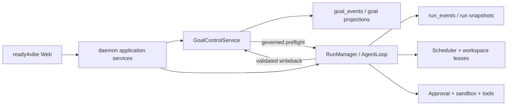
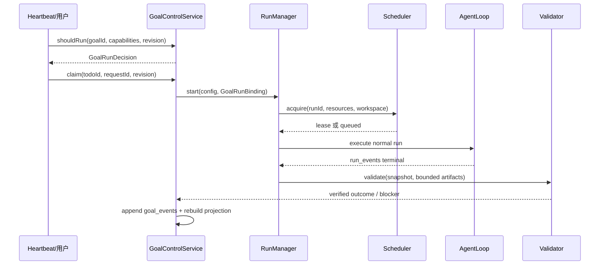

# Spec 34：长期目标控制层与 LoopX 思路整合

**状态：Implemented（Phase 0/Phase 1；daemon 只读 projection/replay API 与 Spec 35 的 Web 只读投影已实现，写 API 和 governed admission 仍后置）**

**日期：2026-08-03**

## 摘要

`ready4vibe` 与 LoopX 的后端架构不同：`ready4vibe` 是 Node.js/TypeScript
的 coding-agent 执行 daemon，LoopX 是 Python/CLI 优先的长期目标控制平面。
因此本项目不直接嵌入 LoopX 的 Python runtime、CLI、文件状态体系或调度器。

本 spec 定义一个 ready4vibe 原生的 `Goal Control` bounded context，提取
LoopX 中与长期目标有关的协议和状态语义，并使用 TypeScript、Zod 和现有
SQLite 基础设施重新实现。目标是让一个长期目标跨越多个 run、session 和
Agent，同时不改变现有 AgentLoop、工具、审批、沙箱、SSE 和安全边界。

## 决策摘要

1. `ready4vibe` 继续拥有执行平面：模型、AgentLoop、工具、审批、沙箱、
   workspace、run 事件和 Web 控制台。
2. 新增 Goal Control 层，拥有长期目标、Todo、项目级 Gate、Evidence、
   Handoff、跨 run 状态投影和 governed-run quota 决策。
3. Goal 事件使用独立的 `goal_events` 流，不伪装成现有的 `run_events`。
4. Goal Control 只在应用服务层与 `RunManager` 协作，`packages/agent` 不
   直接依赖 Goal Control。
5. LoopX 的协议可以作为互操作参考；第一阶段不读取或写入 LoopX 的
   `.loopx/`、`ACTIVE_GOAL_STATE.md` 或 JSONL 状态。
6. 明确的用户发起 run 不受后台 quota 静默拦截；只有绑定长期目标的
   governed/heartbeat 路径使用 `should-run`。
7. 只有独立验证成功后才记录 Goal 完成和 quota spend；模型声称完成不构成
   evidence。

## 整合判定：提取什么、改写什么、暂不嵌入什么

这里的“整合”指吸收可验证的领域语义，不等于把 LoopX 的 Python 包复制到
daemon。按照对 ready4vibe 后端的侵入程度分三档：

| LoopX 能力/资产 | 处理方式 | ready4vibe 的落点 | 不能带入的部分 |
| --- | --- | --- | --- |
| Goal、Todo、Gate、Evidence、Handoff 词汇和状态关系 | 提取并用 TypeScript/Zod 重建 | `packages/contracts` + `GoalControlService` | 不把模型自由文本当作状态写入 |
| 事件追加、幂等、冲突、replay、projection | 提取纯状态语义，改用 SQLite 事务 | `goal_events` + pure reducer/projection | 不复用 `run_events` 的 run-local 序列 |
| `should-run`、quota reason code、周期性判断 | 只实现显式、可审计的最小子集 | Goal admission policy | 不复制完整 `quota.py` 或另起 scheduler |
| session/runtime adapter | 只保留“Goal 选择 run”的接口形状 | daemon application service → `RunManager.start` | 不让 LoopX host bridge 执行工具 |
| compact status/review packet | 作为未来单向 import/export | `external_projection` adapter | 不与本地 canonical state 双写 |
| `.loopx/`、Markdown/JSONL 文件状态 | 默认不嵌入 | 可选离线转换器 | 不引入第二个状态源 |
| CLI、installer、dashboard | 不嵌入 | 复用现有 Web/API | 不在 daemon 内启动第二套 UI/runtime |
| POSIX `fcntl` 锁、LoopX 调度器和 host runner | 不嵌入 | SQLite `BEGIN IMMEDIATE`、现有 Scheduler/Sandbox | 不绕过 Windows/daemon 的安全边界 |

因此第一阶段“可复用”的核心是协议、状态机和纯函数 reducer；运行时、文件布局、
进程管理、锁和界面都必须适配 ready4vibe。若未来需要复制 LoopX 源码而不是重写
语义，必须先核对上游 `LICENSE`、版权声明和 NOTICE，并把许可文件随发行物保留；
当前方案默认不复制源代码。

## 背景与问题

当前 ready4vibe 已经解决了单次 coding run 的主要问题：

- run/turn/step 状态机；
- SQLite append-only run event；
- model/tool/approval/sandbox 边界；
- scheduler 资源并发和 workspace lease；
- daemon 重启后的 `needs-recovery`；
- HTTP/SSE 观察、取消、审批和 retry；
- workspace registry、Git read-only 工具和安全的 Web 设置。

这些能力以 `runId` 为主要边界。以下问题仍然缺少稳定的领域模型：

- 一个目标如何跨多个 run 持续存在；
- 多个 Todo 如何表达下一步、阻塞和交接；
- 用户 Gate 如何跨 session 保留；
- 哪些测试、diff 或 artifact 才能证明 Todo 已完成；
- daemon 重启或 Agent 更换后如何恢复项目级上下文；
- 何时应该继续消耗自动 Agent turn，何时应该等待用户或外部证据。

LoopX 对这些问题提供了有价值的控制平面语义，但它的后端假设不能直接
套入 ready4vibe：LoopX 以 goal 和文件型状态为中心，ready4vibe 以 run 和
SQLite/HTTP daemon 为中心。本 spec 采用“协议兼容、后端原生”的策略。

## 目标与非目标

### 目标

- 为项目/长期目标提供稳定的 `goalId`。
- 在一个 goal 下管理 user/agent Todo、claim、Gate、Evidence 和 Handoff。
- 将每次 ready4vibe run 作为紧凑的 goal evidence 引用，而不是复制完整日志。
- 为自动/周期性路径提供可解释、可审计的 `shouldRun` 决策。
- 在 SQLite 中提供幂等、可重放、隐私分层的 goal event stream。
- 让现有 Web UI 能显示“当前目标正在等谁、下一步是什么、哪个 Gate 阻塞”。
- 保留未来导出到 LoopX 或从 LoopX 导入紧凑状态的可能性。

### 非目标

- 不实现第二个 Agent runtime、模型 provider、tool executor 或 sandbox。
- 不替换 ready4vibe 的 `Scheduler`、`ApprovalBroker`、`WorkspaceRegistry` 或
  `RunManager`。
- 不把 LoopX CLI、Python 包、Bash installer、POSIX 文件锁或 dashboard vendor
  到本项目。
- 不把原始 transcript、tool output、凭据、环境变量或绝对路径写入 Goal state。
- 不在第一阶段实现多租户、RBAC、云端同步或跨机器 Goal coordinator。
- 不把 Goal quota 当成资源调度器，也不允许 quota 绕过审批、沙箱或 workspace
  边界。

## 架构边界



### 职责分配

| 组件 | 拥有的事实 | 不拥有的事实 |
| --- | --- | --- |
| `GoalControlService` | goal、todo、项目 Gate、evidence、handoff、goal quota、状态投影 | 模型输出、工具执行、权限 grant、workspace 绝对路径 |
| `RunManager` | run 创建、排队、取消、retry、恢复、run snapshot | 长期目标优先级和项目 Gate 生命周期 |
| `AgentLoop` | turn、model、tool、approval continuation | goal 选择、quota spend、跨 run handoff |
| `Scheduler` | model/tool/sandbox 容量和 workspace read/write lease | goal 是否值得继续运行 |
| `ApprovalBroker/Policy` | 单次工具调用的 allow/deny/ask | 项目是否完成、用户是否接受结果 |
| `WorkspaceRegistry` | `workspaceId` 到受保护运行根的映射 | Goal registry 和 Todo ownership |
| `apps/web` | 展示和发起受保护 API 请求 | canonical Goal state |

### 依赖方向

推荐依赖关系：

```text
contracts -> goal-control contracts / storage ports
contracts -> scheduler / agent / storage / web API types
storage -> SqliteGoalEventStore
goal-control -> pure reducer / projection / quota policy
apps/daemon -> GoalControlService + RunManager composition
apps/web -> daemon Goal API projection
```

`packages/agent` 不直接 import `packages/goal-control`，避免执行层反向依赖
项目控制层，也避免形成新的循环依赖。

### 与当前 monorepo 的映射

Phase 0 已建立 `packages/goal-control` 的纯 TypeScript 核心，但 daemon 组合根尚未
把它接入默认 run 路径。该包不执行模型、工具、shell、文件系统、Git、MCP 或
sandbox；仍必须通过下面的 Phase 0/1 门禁后才能成为默认能力。建议保持
`apps/daemon` 为唯一组合根：

| 计划模块 | 负责内容 | 允许依赖 |
| --- | --- | --- |
| `packages/contracts` | Goal/Todo/Gate/Evidence/Event/Decision 的 Zod schema、版本和错误码 | `zod`、基础类型 |
| `packages/goal-control` | reducer、projection、`shouldRun`、claim/revision 规则 | `contracts`，不依赖 Agent/React |
| `packages/storage` | `SqliteGoalEventStore` 适配器和事务测试 | `contracts`、Node SQLite |
| `apps/daemon` | Goal API、RunManager 组合、验证器注入和 SSE 广播 | 上述包、现有 scheduler/auth |
| `apps/web` | Goal projection 展示和受保护的 Todo/Gate 操作 | API contracts/UI，不访问 SQLite |

实现顺序应先完成 contracts 和纯 reducer fixture，再接 storage，最后才把 governed
admission 接到 `RunManager`。这样可以在没有 Goal Control 时继续启动和运行现有
unbound run。

## 领域模型

### Goal

`Goal` 是跨 run/session 的长期意图，不等同于一次 `Run`。

建议最小字段：

```ts
type GoalStatus = 'active' | 'paused' | 'blocked' | 'completed' | 'archived';

interface GoalRecord {
  goalId: string;                 // goal_<uuidv7>
  title: string;                  // bounded, public-safe (<= 200 chars)
  objective: string;              // compact objective (<= 4 KiB)
  workspaceId?: string;           // optional default boundary
  status: GoalStatus;
  controlRevision: number;        // optimistic concurrency token
  createdAt: string;
  updatedAt: string;
  schemaVersion: 1;
}
```

Goal 不直接保存 workspace 绝对路径。workspace 仍由
`WorkspaceRegistry` 解析，运行开始时捕获 root，状态和事件只保存 `workspaceId`。

### Todo

```ts
type TodoRole = 'user' | 'agent';
type TodoStatus = 'open' | 'blocked' | 'deferred' | 'done' | 'superseded';
type TodoTaskClass =
  | 'advancement'
  | 'monitor'
  | 'user_gate'
  | 'user_action'
  | 'blocker';

interface GoalTodo {
  todoId: string;                 // todo_<uuidv7>
  goalId: string;
  role: TodoRole;
  status: TodoStatus;
  taskClass: TodoTaskClass;
  title: string;
  priority: 0 | 1 | 2 | 3 | 4;
  claimedBy?: string;
  claimTokenHash?: string;         // raw claim token is never persisted
  claimedAt?: string;
  claimExpiresAt?: string;
  boundAgentId?: string;
  requiredCapabilities?: string[];
  requiredWriteScopes?: string[];
  successorTodoIds?: string[];
  blockedByGateId?: string;
  nextDueAt?: string;
  completedAt?: string;
}
```

第一阶段使用显式字段，不复制 LoopX 中依赖自然语言正则推断任务类别的复杂
规则。模型输出不能自动改变 `taskClass` 或授予 capability；这些字段必须由
应用服务或受保护的用户写操作设置。

Todo claim 使用乐观并发而不是进程内布尔锁：

```ts
interface TodoClaimRequest {
  goalId: string;
  todoId: string;
  expectedRevision: number;
  claimant: string;
  requestId: string;
  leaseMs: number;
}
```

服务端在同一事务内检查 `expectedRevision`、当前状态和未过期 claim，然后追加
`todo.claimed` 并递增 `controlRevision`，同时生成只在本地使用的不可预测
`claimToken`；事件和 projection 只保存其 `claimTokenHash`。重复请求用 `requestId` 幂等；不同请求或陈旧 revision 返回冲突而
不是抢占已有 claim。这样即使 daemon 未来出现多个 heartbeat 或多个 Agent，也不
会把文件锁语义误带入应用层。

### 项目级 Gate 与工具 Approval

```ts
type GoalGateKind = 'user_decision' | 'owner_review' | 'external_evidence' | 'health';
type GoalGateStatus = 'open' | 'approved' | 'rejected' | 'deferred' | 'expired';

interface GoalGate {
  gateId: string;
  goalId: string;
  kind: GoalGateKind;
  status: GoalGateStatus;
  question: string;
  blocking: boolean;
  openedAt: string;
  resolvedAt?: string;
  resolvedBy?: 'user' | 'owner' | 'system';
}
```

Goal Gate 是跨 session 的项目决策。`ApprovalBroker` 仍然只处理一次工具调用；
两者必须有不同的 ID、事件类型和 API。

### Evidence 与 Handoff

Evidence 只保存紧凑事实和来源引用：

```ts
interface GoalEvidence {
  evidenceId: string;
  goalId: string;
  kind: 'validation' | 'artifact' | 'run' | 'blocker' | 'decision';
  summary: string;
  status: 'observed' | 'validated' | 'failed' | 'stale';
  refs: {
    runId?: string;
    eventIds?: string[];
    artifactIds?: string[];
  };
  recordedAt: string;
}
```

Handoff 是一个 Todo 或 Evidence 指向后续 Todo 的显式关系。它不能只存在于
模型摘要或聊天记录中。

## Goal Event Contract

ready4vibe 当前 run event 使用 dotted event type 和 run-local `seq`。Goal event
采用同样风格，但拥有独立的 goal-local 序列：

```ts
interface GoalEvent<TPayload = Record<string, unknown>> {
  schemaVersion: 'ready4vibe_goal_event_v0';
  eventId: string;                // stable idempotency key
  goalId: string;
  appendSequence: number;        // monotonic per goal
  eventType:
    | 'goal.created'
    | 'goal.updated'
    | 'goal.completed'
    | 'todo.added'
    | 'todo.claimed'
    | 'todo.claim_released'
    | 'todo.updated'
    | 'todo.blocked'
    | 'todo.deferred'
    | 'todo.completed'
    | 'gate.opened'
    | 'gate.resolved'
    | 'run.recorded'
    | 'evidence.attached'
    | 'handoff.created'
    | 'writeback.failed'
    | 'quota.spent'
    | 'projection.refreshed';
  recordedAt: string;
  producer: string;
  privacy: 'public_safe' | 'local_private' | 'private_pointer';
  projectionVersion: 'goal_control_projection_v0';
  refs: {
    todoId?: string;
    gateId?: string;
    evidenceId?: string;
    runId?: string;
    bindingId?: string;
    turnKey?: string;
    parentEventId?: string;
  };
  payload: TPayload;
}
```

### 追加语义

- `eventId` 相同且规范化内容相同：返回已有事件，不重复追加。
- `eventId` 相同但内容不同：返回冲突，不能覆盖旧事件。
- `appendSequence` 由 SQLite 事务分配，不能由客户端指定。
- 事件只能追加，不能修改或删除历史事件。
- `refs` 只能指向紧凑 ID；不得把原始日志、凭据、路径或完整工具输出放入
  `payload`。
- claim 必须带不可预测的本地 `claimToken`、事件中的 `claimTokenHash` 和过期时间；
  只有持有 token 且 revision 未过期的写回才可以完成 Todo，不能凭 `todoId` 强行完成。
- projection 必须带有 `lastEventId`、`lastAppendSequence`、
  `sourceEventCount` 和 `sourceChecksum`。
- 非法 privacy、未知 event type、超长文本和 secret-shaped 字段必须 fail closed。

### LoopX 互操作映射

内部事件不强制使用 LoopX 的 snake_case 名称。若未来需要导出，建立显式映射：

| ready4vibe | LoopX-compatible projection |
| --- | --- |
| `todo.added` | `todo_added` |
| `todo.claimed` | `todo_claimed` |
| `todo.completed` | `todo_completed` |
| `run.recorded` | `run_recorded` |
| `evidence.attached` | `evidence_attached` |
| `quota.spent` | `quota_spent` |

不允许把两个系统同时写同一份 canonical 状态。互操作适配器必须单向、可重放，
并保留源系统的 `eventId` 和 `goalId`。

## SQLite 存储设计

第一阶段复用 `.ready4vibe/events.sqlite`，但保留现有 `run_events` 表不变，新增
独立表：

```sql
CREATE TABLE IF NOT EXISTS goal_events (
  goal_id TEXT NOT NULL,
  append_sequence INTEGER NOT NULL,
  event_id TEXT PRIMARY KEY,
  schema_version TEXT NOT NULL,
  event_type TEXT NOT NULL,
  recorded_at TEXT NOT NULL,
  producer TEXT NOT NULL,
  privacy TEXT NOT NULL,
  projection_version TEXT NOT NULL,
  refs_json TEXT NOT NULL,
  payload_json TEXT NOT NULL,
  fingerprint TEXT NOT NULL,
  UNIQUE (goal_id, append_sequence)
);

CREATE INDEX IF NOT EXISTS goal_events_goal_seq_idx
  ON goal_events (goal_id, append_sequence);
```

`SqliteGoalEventStore` 需要提供：

```ts
interface GoalEventStore {
  append<T>(event: NewGoalEvent<T>): Promise<StoredGoalEvent<T>>;
  appendBatch(events: readonly NewGoalEvent[]): Promise<StoredGoalEvent[]>;
  read(goalId: string, afterSequence?: number): Promise<StoredGoalEvent[]>;
  lastSequence(goalId: string): number;
  close(): void;
}
```

单个追加和 batch 追加都必须在 `BEGIN IMMEDIATE` 事务中完成。Goal event 的
序列不能复用 run event 的 `seq`，因为一个 goal 会关联多个 run。

追加算法固定为：开始事务 → 按 `eventId` 查找已有事件 → 已存在时比较
`fingerprint` 并返回 no-op 或 conflict → 计算该 goal 的下一个序列 → 插入并提交。
事件 ID 冲突不能通过覆盖旧 payload 解决；事务失败时不得向 SSE 广播半批事件。

projection 第一阶段可按需从事件重放；当 goal 数量或首屏延迟证明需要时，再增加
`goal_projections` 缓存表。缓存永远是派生数据，不能成为新的写入入口。

## Run 绑定与生命周期

### 运行绑定

现有 run 保持兼容；新增可选的应用层绑定：

```ts
interface GoalRunBinding {
  bindingId: string;
  goalId: string;
  todoId?: string;
  agentId?: string;
  mode: 'interactive' | 'governed';
  controlRevision?: number;
}
```

绑定信息可以出现在 run snapshot 的安全摘要和 `run.recorded` refs 中，但不应
写入用户 prompt。没有绑定的 run 继续按现有 ready4vibe 行为执行。

### Governed run 流程

```text
1. 读取 Goal projection 和当前 control revision
2. GoalControlService.shouldRun(goalId, agentId, capability snapshot)
3. 若是 blocked/wait/paused：不启动自动 Agent turn，返回可解释原因
4. 若 eligible：claim selected Todo（幂等）
5. RunManager 创建普通 ready4vibe run
6. Scheduler 决定资源和 workspace lease
7. AgentLoop 执行并写入 run_events
8. 独立验证 run 结果、测试、diff 或 artifact
9. 验证成功：追加 run.recorded、evidence.attached、todo.completed/update
10. refresh projection，再追加 quota.spent
11. 验证失败或恢复状态：写 blocker/recovery evidence，不 spend delivery quota
```



验证器是应用层注入的独立 port，不是模型自报结果，也不是 Goal Control 自己执行
工具：

```ts
interface GoalRunValidator {
  validate(input: {
    goalId: string;
    binding: GoalRunBinding;
    runId: string;
    snapshot: Readonly<Record<string, unknown>>;
  }): Promise<{
    status: 'validated' | 'blocked' | 'stale';
    summary: string;
    refs: { eventIds?: string[]; artifactIds?: string[] };
  }>;
}
```

验证器只能消费受限的 run snapshot、测试结果、diff/artifact 引用和 hash；若需要
执行测试或读取文件，应通过现有 Tool/Sandbox/Approval/Scheduler 端口，并把结果
先写回 `run_events`，不能在 Goal Control 内偷偷创建进程。

上述流程中 `run_events` 和 `goal_events` 的提交顺序不能互相伪装：

1. `RunManager` 先按现有合约创建并执行 run，`run_events` 是执行事实源；
2. 验证器只读取 run snapshot、受限 diff/test/artifact 摘要，生成 compact outcome；
3. `GoalControlService` 以 `bindingId + controlRevision + turnKey` 做条件写回；
4. Goal 写回失败时保留已完成的 run，追加 `writeback.failed`，由幂等重试修复，
   不能重新执行旧工具调用。

可视化时应明确显示“run 已完成但 Goal 写回待修复”，不能把两条事件流合并成一个
看似原子但实际不可回滚的状态。

### Interactive run

用户明确点击“开始 run”属于显式操作，不应被 quota 静默吞掉。它仍必须通过
ready4vibe 的 auth、workspace、approval、sandbox 和 scheduler 边界。若用户希望
在 Gate 期间执行受限动作，必须走明确的 Goal Gate/审批 API，并记录原因；不能
通过把 run 标为 interactive 绕过高风险工具策略。

### Recovery

ready4vibe 现有 `needs-recovery` 语义继续有效：

- 未完成 run 只能标记为 recovery evidence；
- 不自动完成 Todo，不自动 spend quota；
- 用户确认 retry 后创建新的 run，并通过 `refs.runId` 关联旧 run；
- 旧 run 的不确定工具调用不能被当作已验证 evidence。

### 状态不变量与失败矩阵

以下不变量由 reducer 和应用服务共同保证，不能只依赖 Web UI：

- `goal.completed` 只能由显式验证写回产生；仍有 blocking Gate、未完成的
  required Todo 或未解决的 `writeback.failed` 时不得完成 Goal。
- `Todo.status=done` 必须引用至少一个 `validated` Evidence；`observed` 或模型摘要
  只能让 Todo 保持 open/blocked。
- 一个 Todo 同时最多只有一个有效 claim；过期 claim 必须先追加
  `todo.claim_released`，旧 token 不能被重用。
- Gate 的 resolve 必须匹配当前 `controlRevision`；陈旧客户端只能得到冲突，
  不能覆盖新决定。
- projection 可以删除并重建；`goal_events` 一旦提交不可原地修改。

| 场景 | `run_events` | `goal_events` | 是否消耗 delivery quota | 后续动作 |
| --- | --- | --- | --- | --- |
| Goal admission 被 Gate 阻塞 | 无新 run | 可记录 decision/状态刷新 | 否 | 等待用户 resolve |
| admission eligible，Scheduler 无容量 | run 进入 queued | 记录 `run.recorded` 前不写完成 | 否/按产品策略只记 attempt | 等待 Scheduler，不当作 Goal blocker |
| run 成功，验证成功 | terminal completed | `run.recorded` + evidence + todo update | 是，幂等 | 继续下一个 Todo |
| run 成功，验证失败 | terminal completed | blocker evidence，必要时 `writeback.failed` | 否 | 人工修复或新 run |
| daemon 重启中断 | `needs-recovery` | recovery evidence | 否 | 用户确认 retry，创建新 binding |
| Goal 写回冲突 | terminal completed | `writeback.failed` | 否，直到修复 | 重读 projection 后幂等重试写回 |

## Quota 与 Scheduler 协作

### 两个不同的决策

`GoalControlService.shouldRun` 只回答：

```text
项目现在是否有一个可执行、未被 Gate 阻塞、值得消耗一次自动 turn 的 Todo？
```

`Scheduler.acquire` 只回答：

```text
当前是否有 model/tool/sandbox/workspace 资源可以执行这个 run？
```

顺序必须是：Goal admission -> Run creation -> Scheduler resource admission。
Goal quota 不得绕过 scheduler；scheduler 也不能把项目 Gate 当成资源问题。

`shouldRun` 的最小返回契约如下，供内部服务和未来 API 共用：

```ts
type GoalRunDecisionReason =
  | 'todo-ready'
  | 'no-open-todo'
  | 'blocked-by-gate'
  | 'blocked-by-health'
  | 'paused-by-user'
  | 'throttled-by-quota'
  | 'stale-control-revision';

interface GoalRunDecision {
  schemaVersion: 'ready4vibe_goal_should_run_v0';
  decision: 'eligible' | 'waiting' | 'blocked' | 'paused' | 'throttled';
  reason: GoalRunDecisionReason;
  goalId: string;
  controlRevision: number;
  selectedTodoId?: string;
  nextCheckAt?: string;
  turnKey?: string;
}
```

`eligible` 只表示可以尝试创建 run，不表示已经取得模型、工具或 workspace 资源；
资源不足仍由现有 Scheduler 返回 queued/throttled 结果。`stale-control-revision`
必须 fail closed，并要求重新读取 projection 后再 claim。

### 最小状态集合

第一版只实现以下状态：

```text
blocked_health
operator_gate
eligible
waiting
throttled
paused
```

第一版不移植 LoopX `quota.py` 中的自然语言分类、Codex automation ack、复杂
monitor lane 或 reward memory。先使用显式 `taskClass`、`nextDueAt`、Gate 和
最后一次验证结果。

### Spend 规则

只有以下条件同时满足才允许追加 `quota.spent`：

- 本次 run 由 Goal preflight 允许；
- Todo claim 和 binding 没有冲突；
- 独立验证已完成；
- writeback 是幂等且持久化成功；
- 本次 `turnKey` 尚未 spend。

quiet poll、等待 Gate、失败验证、重复 retry、状态刷新和没有实际进展的 no-op
不消耗 delivery quota。

## API 与 UI 计划

第一阶段不暴露完整 Goal CRUD，只提供受现有 pairing/Bearer/CSRF/Origin 保护的
只读 projection/replay API：

| 方法 | 路径 | 作用 |
| --- | --- | --- |
| `GET` | `/api/v1/goals` | 返回安全的 goal projection 摘要列表 |
| `GET` | `/api/v1/goals/:goalId` | 返回首屏 projection、Gate、Todo 和 quota 状态 |
| `GET` | `/api/v1/goals/:goalId/events?after=<sequence>&limit=<n>` | 返回受限的 Goal event JSON 回放（不是第二条 SSE 流） |
| `POST` | `/api/v1/goals` | 后置：创建 goal，要求明确 objective 和 workspace boundary |
| `POST` | `/api/v1/goals/:goalId/todos` | 后置：创建 user/agent Todo |
| `POST` | `/api/v1/goals/:goalId/todos/:todoId/claim` | 后置：幂等 claim |
| `POST` | `/api/v1/goals/:goalId/gates/:gateId/resolve` | 后置：用户/owner Gate 决策 |
| `POST` | `/api/v1/goals/:goalId/runs/decision` | 后置：返回 governed `shouldRun`，不直接启动 run |

Goal API 当前只读且不返回：workspace 绝对路径、原始 transcript、凭据、完整工具输出、
模型 provider secret、私有日志或未脱敏环境变量。

列表和详情均通过 `GoalProjectionBuilder` 从 `goal_events` 重放；Todo 的
`claimTokenHash` 以及事件 payload 中同名的内部字段在 API 边界剥离。事件回放
支持非负 `after` 游标和最多 500 条（可请求但不超过 1,000 条）的 bounded page，
不创建新的 scheduler、SSE stream 或状态源。

ready4vibe Web 仍是主要前台。LoopX 风格的 projection 是 Web 的输入，不是第二
个 dashboard source of truth。

### 配置引导与设置界面门禁

Goal Control 的接入不能把用户推回手动编辑配置文件。Web 首屏沿用现有
Settings/onboarding 入口，并按向导顺序解释：

1. pairing、连接方式和 TLS/证书状态；
2. workspace 选择或添加（只显示安全 label/id，不显示 daemon 绝对路径）；
3. 模型 provider/model 设置（API key 只写入 daemon 的安全 secret adapter，写入后
   不回显、不进浏览器存储）；
4. task trust、sandbox、approval、网络和并发/资源限制；
5. Goal/Todo/Gate 的显式确认和下一步摘要。

普通用户不得需要编辑 `.env`、YAML、JSON、PEM 或 SQLite 文件才能完成配置。UI
可以提供安全的 reset、probe、certificate guidance 和明确的 confirm/cancel 操作，
但这些便利入口不能削弱 pairing、TLS、审批、沙箱、workspace 或 Goal revision
门禁。Goal API 仍只接受经过 schema 校验的非 secret 字段；路径、token、环境变量
和完整输出不从表单进入 Goal event。

## 隐私与安全边界

- Goal event payload 只允许 compact text、稳定 ID、状态、hash、数量和引用。
- workspace 路径只保留 `workspaceId`；绝对路径由 `WorkspaceRegistry` 在 daemon
  内部解析。
- run 的完整事件和受限输出仍在 ready4vibe 的本地 SQLite 中，不复制到 Goal。
- Goal Gate 的写操作需要现有认证、CSRF、Origin 和用户确认边界。
- Goal Control 不得授予 tool、network、filesystem 或 sandbox capability。
- 向未来外部 LoopX 导出前必须经过 public/private boundary scan。
- Goal state 默认本地私有；若以后生成 tracked/public projection，必须显式脱敏。

## 实现阶段

### Phase 0：合同和 fixture（已完成）

- 在 `packages/contracts` 定义 Goal/Todo/Gate/Evidence/Handoff/GoalEvent/
  GoalProjection/GoalShouldRunDecision/GoalRunBinding Zod schema，包含
  `schemaVersion`、`controlRevision`、`appendSequence`、privacy 和隐私扫描。
- `packages/goal-control` 提供内存 event store、canonical JSON、deterministic
  fingerprint、projection replay、最小 `shouldRun`、并发 claim 和 stale revision
  fail-closed。
- contract/reducer tests 覆盖 secret、token、环境变量、绝对路径、未知 event type、
  重复/冲突 event、稳定 checksum、Gate/quota/admission 和未验证写回。
- Todo claim event 只保存不可逆 hash；原始 claim token 不进入事件、projection、日志
  或浏览器存储。
- 不改变 daemon 默认 run admission、`run_events`、AgentLoop、Scheduler、Approval、
  Sandbox 或 Workspace 行为。

### Phase 1：SQLite event store 与 read-only projection（已完成）

- 增加 `goal_events` 表和 `SqliteGoalEventStore`。
- 实现 goal event normalize、fingerprint、idempotent append 和 replay。
- 实现 `GoalProjectionBuilder` 和 `SessionRunProjection`。
- daemon 组合根可选注入 `GoalEventStore`，生产入口与现有 `events.sqlite` 共用文件，
  但只新建/访问独立的 `goal_events` 表。
- 增加受认证的只读 `GET /api/v1/goals`、`GET /api/v1/goals/:goalId` 和
  `GET /api/v1/goals/:goalId/events`，不接入 run admission。

Phase 1 已实现 `packages/storage` 的独立 `goal_events` SQLite adapter、事务测试、
只读 projection/replay API 和 daemon wiring；它不复用、改写或迁移现有 `run_events`
表。adapter 与 API 通过了并发、回滚、幂等、冲突、重启、认证和隐私验收。Goal
写 API、Goal quota admission、验证写回和 Web 首屏仍属于后续阶段。

### Phase 2：Run binding 与 governed preflight

- 创建可选 GoalRunBinding。
- 在 daemon 应用服务层执行 `shouldRun` 和 Todo claim。
- 保持未绑定 run 和显式 interactive run 的现有路径不变。
- 用 scheduler 的真实容量结果补充 projection，但不复制 scheduler 状态。

### Phase 3：验证写回与恢复

- 将验证摘要、run 引用、blocker 和 handoff 写入 Goal event。
- 只有验证后才完成 Todo 和 spend quota。
- 覆盖 daemon restart、retry、duplicate write、stale revision 和 scheduler conflict。

### Phase 4：Web 与可选 LoopX 互操作

- [Spec 35](35-goal-web-readonly-projection.md) 先在现有 Web 首屏显示 goal、Gate、
  selected Todo、最近 evidence、quota 摘要和下一步；该切片只读、内存态，不增加
  Goal SSE、轮询或执行能力。
- Todo/Gate 写操作必须等到单独的受保护 API、CSRF/Origin、revision 和审计设计完成；
  Spec 35 不提供这些按钮。
- 如有真实需求，再实现 LoopX-compatible export/import；默认单向、只读、可重放。

## 测试与验收

### Contract tests

- GoalEvent schema 拒绝未知类型、错误 privacy、超长字段和 secret-shaped 字段。
- 相同 event ID 的相同内容追加是 no-op。
- 相同 event ID 的不同内容返回 conflict。
- replay 顺序按 goal-local `appendSequence` 稳定。
- projection 包含最后事件、序列、checksum 和版本。

### Integration tests

- 一个 goal 关联多个 run，projection 能恢复 Todo、Gate 和最近 evidence。
- `shouldRun` blocked 时 governed run 不发起模型请求。
- scheduler 无容量时进入 queued，而不是被误报为 goal blocker。
- run 成功但验证失败时不完成 Todo、不 spend quota。
- recovery/retry 不重复执行旧 tool call，不重复完成 Todo。
- 两个 Agent 不能静默 claim 同一个 Todo。

### Security tests

- Goal API 继承现有 pairing/Bearer/CSRF/Origin 门禁。
- projection 和 JSON replay 不包含绝对路径、claim token/hash、API key、环境变量和原始输出。
- Goal Control 不能凭 Todo 或 Gate payload 注册 tool、放宽 sandbox 或修改 approval。
- Windows 下 SQLite 并发写入使用事务测试；不依赖 LoopX 的 `fcntl` 文件锁。

### 性能目标

首版只记录目标，不宣称已经达到性能指标。应测量：

- `goal projection` 首屏 p95 延迟；
- goal event append p95 延迟；
- 事件重放时的目标数/事件数上限；
- governed preflight 对 run 创建的额外延迟；
- daemon restart 后 projection rebuild 时间。

## 迁移、互操作与回滚

### 默认迁移路径

第一阶段不迁移已有 LoopX 文件，也不要求用户安装 Python。ready4vibe 从一个
新的空 Goal 开始；现有 run 没有 Goal binding 时继续正常工作。

### 可选导入

未来可以读取 LoopX 的 compact `status`/`review-packet`，转换为只读
`external_projection`，但不能把它当作本地 canonical event。用户确认后才允许
创建本地 Goal/Todo，并记录来源版本和 checksum。

### 回滚

- 删除/关闭 Goal Control 不影响 `run_events` 和现有 run API。
- governed path 发生错误时，自动路径应 fail closed；显式 interactive run 仍可按
  现有安全策略执行。
- `goal_events` 可保留为本地私有历史，projection 可以重建，不需要修改 run event。

## 风险与替代方案

| 方案 | 结论 | 原因 |
| --- | --- | --- |
| 完整 vendor LoopX | Reject | Python、文件状态、POSIX 锁、CLI 和现有 SQLite/daemon 重叠 |
| 外部 LoopX companion | 可选 | 可快速验证控制模型，但有安装、进程和 Windows 运维成本 |
| 只移植协议/算法 | Recommended | 适配 ready4vibe 后端，保留原生安全和存储边界 |
| 暂不实现 Goal Control | Valid fallback | 若产品只做短生命周期单 run，可避免过早复杂化 |

## 参考资料

- [ready4vibe Architecture](../architecture.md)
- [Run/Event Contract](02-run-event-contract.md)
- [SQLite EventStore](04-storage-and-health.md)
- [Run API/SSE](06-run-api-sse.md)
- [Approval Continuation](21-approval-continuation.md)
- [Restart Recovery](22-restart-recovery.md)
- [Guided Workspace Registry](31-workspace-registry.md)
- [LoopX custom runner integration](https://github.com/huangruiteng/loopx/blob/main/docs/guides/custom-agent-runner-integration.md)
- [LoopX event-sourced state contract](https://github.com/huangruiteng/loopx/blob/main/docs/reference/protocols/event-sourced-state-contract-v0.md)
- [LoopX session runtime adapter](https://github.com/huangruiteng/loopx/blob/main/docs/integrations/session-runtime-control-plane-adapter.md)
