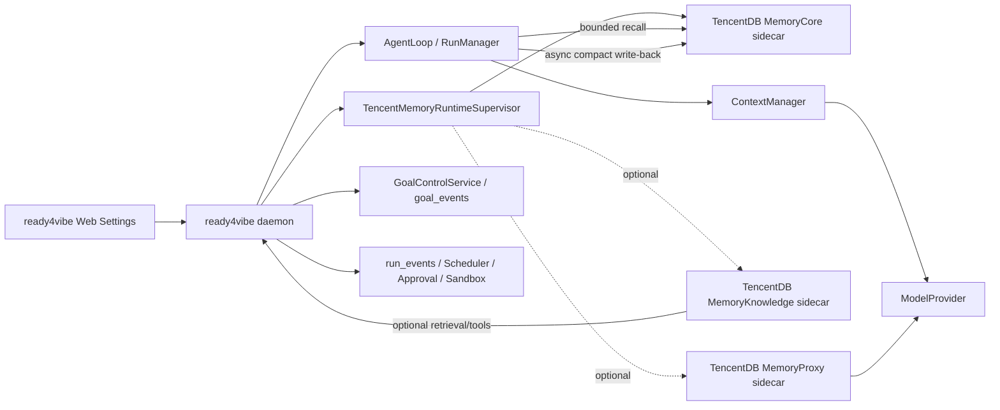
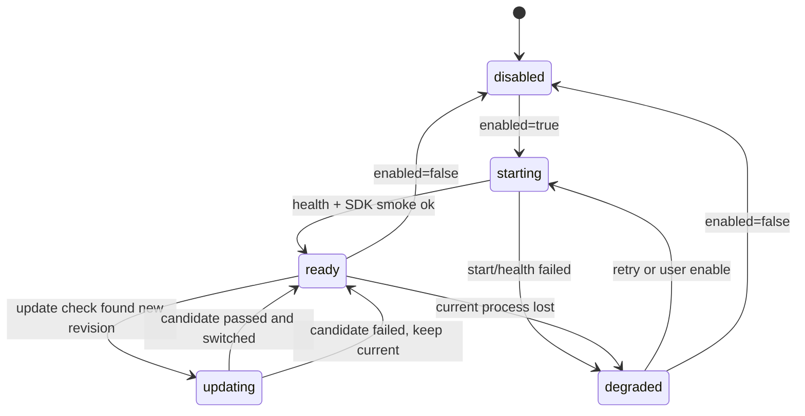

# Spec 39：TencentDB Agent Memory 可切换融合与自动更新

- 状态：Phase 0 contract/Noop、Phase 1 MemoryCore HTTP adapter、Phase 2 settings/status API、Phase 3 runtime supervisor、Phase 4 bounded run integration implemented；Proxy/Knowledge 与运营增强为后续阶段
- 日期：2026-08-03
- 适用范围：ready4vibe daemon、Web Settings、AgentLoop 前后置上下文、运行时进程管理
- 上游项目：[TencentCloud/TencentDB-Agent-Memory](https://github.com/TencentCloud/TencentDB-Agent-Memory)

## 1. 摘要

ready4vibe 不直接复制 TencentDB Agent Memory 源码，也不把它改造成
ready4vibe 的第二个 Agent runtime。推荐方案是：

> TencentDB Agent Memory 独立 sidecar + ready4vibe 原生 Adapter + Web 开关 +
> GitHub 上游自动构建、切换和回滚。

这样可以同时满足四个要求：

1. 默认关闭时，现有 run、Web、Goal Control 和模型调用行为不变；
2. 开启后，MemoryCore 可以为 AgentLoop 提供长期记忆召回和写回；
3. TencentDB 仓库更新时，系统自动拉取、构建、健康检查并切换到新 revision；
4. 新版本构建或启动失败时保留当前可用 revision，不影响 Web 使用和普通 run。

“实时更新”在本 spec 中定义为自动检查上游、自动构建候选实例、健康检查后自动切换，
不定义为运行中的 Node 模块热替换。热替换会破坏请求中的引用、连接和正在进行的
Agent turn，因此不作为 ready4vibe 的运行时契约。

## 1.1 Phase 0 implementation gate

Phase 0 only freezes the ready4vibe-side contract and a no-op provider. It adds
versioned `AgentMemoryMode`, explicit identity, bounded recall/write/status DTOs,
and a `NoopAgentMemoryProvider` whose `off` mode performs no network, SDK,
subprocess, prompt, or AgentLoop work. It does not add a TencentDB dependency,
sidecar process, settings API, Web card, model proxy, or context injection.

The provider remains an optional application-service port. Existing run and Goal
authorities stay unchanged until a later phase supplies a validated provider and
an explicit per-run runtime snapshot.

## 1.2 Phase 1 implementation gate

Phase 1 now contains a daemon-local `TencentMemoryCoreProvider` that uses the
public MemoryCore v3 HTTP surface through native `fetch`; it deliberately does
not add the upstream SDK or a sidecar process to the ready4vibe runtime. The
adapter boundary currently provides:

- explicit `team_id`/`agent_id`/`user_id`/optional `session_id` isolation fields;
- `GET /health`, `POST /v3/atomic/search`, and
  `POST /v3/conversation/add` handling with bearer/service headers;
- bounded response decoding, untrusted recall items, UTF-8 byte limits, timeout
  and malformed/schema/5xx degradation;
- a serial, non-blocking write-back queue containing only compact summary,
  facts, decisions, outcome, and evidence references;
- provider-identity matching so a caller cannot use an adapter instance for a
  different team, agent, user, or session.

This section records the Phase 1 adapter boundary: at that stage it was not wired
into `ContextManager`, `AgentLoop`, `RunManager` snapshots, Web Settings, sidecar
supervision, or the default run creation path. Phase 2–4 add those application
service boundaries while `off` and all existing unbound interactive runs keep
their previous behavior.

## 1.3 Phase 2 implementation gate

Phase 2 adds a durable, non-secret `agent-memory/v1` settings snapshot and an
authenticated daemon API. It stores only the enabled/mode/identity/upstream
policy fields described by this spec; MemoryCore credentials, environment
variables, absolute paths, and sidecar logs are never accepted or returned.

The API can report status and probe the configured provider. In the Phase 2-only
slice, update and rollback were explicit capability calls returning a stable
degraded/update code; Phase 3 now supplies the supervisor while preserving that
fail-soft API shape. The Web surface is a small Settings card that edits the same
snapshot and displays bounded health/revision state; it does not create a second
scheduler, SSE stream, or run admission gate.

## 2. 用户需求与非目标

### 2.1 用户需求

- TencentDB 融合必须可以从 Web Settings 一键开启或关闭；
- 关闭后不得启动 TencentDB 进程、发起记忆请求或改变 prompt；
- Web 不因为 TencentDB 暂时不可用而被锁死，普通任务仍可以查看、创建和运行；
- 不要求用户手动编辑 `.env`、YAML、SQLite 或 sidecar 目录；
- 能看到当前模式、健康状态、当前 revision、上一次检查时间和更新结果；
- 上游仓库有新提交时自动拉取、构建、切换；
- 新版本失败必须保留旧版本并可以显式回滚；
- 随上游仓库演进时，ready4vibe 只维护稳定的 Adapter/Contract，不把 upstream
  内部目录结构当作本项目的公共 API。

### 2.2 非目标

- 不用 TencentDB 接管 Goal、Todo、Gate、Evidence、Handoff、quota 或 `shouldRun`；
- 不用 TencentDB 替换 `run_events`、`goal_events`、RunManager、Scheduler、Approval、
  Sandbox、WorkspaceRegistry 或现有 HTTP/SSE 合约；
- 不把完整 TencentDB 源码 vendor 到 ready4vibe 主进程；
- 不在第一阶段把 Wiki、CodeGraph 或 MemoryKnowledge 工具暴露成任意高风险工具；
- 不把原始 transcript、原始 tool output、API key、环境变量、绝对路径或私密日志
  无筛选地写入长期记忆；
- 不因为引入记忆层而增加用户每次使用 Web 的额外安全确认、审批或登录步骤。现有
  daemon 认证边界继续存在，但记忆开关是普通 Settings，不应成为 Web 使用障碍。

## 3. 上游开源事实（截至本方案编写时）

以下信息来自 Tencent 官方仓库及其 `feat/server_team` 文档，接入实现仍必须在构建
候选 revision 时读取该 revision 自己的 README、manifest 和 lockfile，不能只依赖本文的
静态描述。

| 组件 | 已知职责 | 默认入口/技术边界 | ready4vibe 接入方式 |
| --- | --- | --- | --- |
| MemoryCore | L0/L1/L2/L3 记忆、记忆元数据、召回和写回 | Node.js/TypeScript；Node >=22.16；HTTP Gateway 默认 `8420`；SQLite/本地文件 | 首选方式：独立进程 + `@tencentdb-agent-memory/memory-sdk-ts-v2` |
| MemoryProxy | 透明转发 OpenAI/Anthropic，请求前注入记忆、请求后写回 | 默认端口 `8096`；对上游模型提供代理入口 | 可选兼容方式：专用 Proxy Provider，不直接拼接现有 Provider URL |
| MemoryKnowledge | Wiki、CodeGraph、异步索引及知识工具 | 默认端口 `8421`；`/v3/tools/list`、`/v3/tools/call` | 后置 Adapter；先作为受限检索能力，不改变 Goal 事实源 |

MemoryCore v3 请求需要 `teamId`、`agentId`、`userId`，`sessionId` 可选。ready4vibe
必须显式维护这组身份映射，不从原始 prompt 或任意浏览器字段推导。MemoryCore 负责
记忆和元数据；Wiki/CodeGraph 内容由 MemoryKnowledge 提供，不能把两者当成同一存储。

仓库采用 MIT 许可证；若以 sidecar 形式发布或缓存其构建产物，必须随发布物保留上游
许可证和版权说明。本文只提取公开架构和接口启发，不复制上游源代码、私有协议或界面。

## 4. 与 ready4vibe 的架构差异

ready4vibe 是 TypeScript monorepo，`apps/daemon` 组合 AgentLoop、RunManager、模型
Provider、事件存储、工具、审批和 Web API；TencentDB 是一个拥有自己 HTTP Gateway、
存储和进程生命周期的记忆服务。两者不能通过“把一个 package import 进另一个 package”
直接融合，原因包括：

- 进程生命周期不同：ready4vibe 需要 daemon 可重启，TencentDB 需要独立监听端口；
- 事实源不同：ready4vibe 的 Goal/run 事件必须可审计，记忆是派生数据；
- API 演进不同：MemoryCore v3 的身份字段和 SDK 版本可能随 upstream 更新；
- 模型入口不同：ready4vibe 的 `OpenAICompatibleProvider` 会在 `baseUrl` 后追加
  `/chat/completions`，而 MemoryProxy 的入口和转发协议需要单独适配；
- 存储边界不同：ready4vibe 的 `events.sqlite` 不应与 TencentDB 的 SQLite 文件混用；
- 更新方式不同：主进程不能在运行时热替换 upstream Node 模块，必须切换 sidecar 实例。

因此融合点应放在稳定的 ports/adapters：`AgentMemoryProvider`、身份映射、上下文
转换、写回队列和 `TencentMemoryRuntimeSupervisor`，而不是放在 AgentLoop 内部或
upstream 私有模块路径。

## 5. 总体架构



### 5.1 事实源与派生层

| 领域 | 唯一事实源 | TencentDB 可做的事 |
| --- | --- | --- |
| Goal、Todo、Gate、Evidence、Handoff、quota、`shouldRun` | ready4vibe Goal Control / `goal_events` | 读取经过筛选的摘要，不能写回 canonical 状态 |
| run 生命周期、turn、tool、approval、sandbox、workspace lease | ready4vibe RunManager / `run_events` | 接收 compact run summary 作为记忆输入，不能替换事件流 |
| 模型 Provider 与模型密钥 | ready4vibe model settings/secret boundary | MemoryProxy 可作为可选请求路径，不能保存或回显密钥 |
| 长期记忆、Skill、记忆元数据 | TencentDB MemoryCore | 提供 recall、record、memory health |
| Wiki、CodeGraph、异步索引 | TencentDB MemoryKnowledge | 提供受限知识检索和工具调用 |
| Web 展示和开关 | ready4vibe Web + daemon settings API | 展示状态、revision、更新结果，不直接访问 sidecar |

## 6. 可切换运行模式

配置字段 `mode` 使用以下稳定枚举，`enabled=false` 时 mode 仅作为下次开启时的预选值：

| 模式 | 进程 | AgentLoop 行为 | 推荐阶段 |
| --- | --- | --- | --- |
| `off` | 不启动 | 不召回、不写回、不改 prompt | 默认值、故障总降级 |
| `memory-core` | MemoryCore | 前置 recall，终态后异步 record | 首选 MVP |
| `proxy` | MemoryProxy（MemoryCore 由 Proxy 管理或按 upstream 要求启动） | 模型请求经 Proxy 注入/写回；必要时回退直连 Provider | 兼容性验证后 |
| `full-stack` | MemoryCore + MemoryProxy + MemoryKnowledge | recall、Proxy 注入、知识工具和异步 record | 后置实验 |

建议默认配置：`enabled=false`、`mode=memory-core`、`autoUpdate=true`。用户打开开关后
新 run 读取新的运行时快照；已经开始的 run 保留自己的 provider/memory snapshot，避免
中途切换造成一次 turn 前后语义不一致。

## 7. ready4vibe 原生合约

### 7.1 AgentMemoryProvider

Adapter 不应暴露 TencentDB 私有 response 类型。建议在 `packages/contracts` 定义
版本化的领域类型，在 daemon 中提供 Tencent 实现：

```ts
export type AgentMemoryMode = 'off' | 'memory-core' | 'proxy' | 'full-stack';

export interface AgentMemoryIdentity {
  teamId: string;
  agentId: string;
  userId: string;
  sessionId?: string;
}

export interface AgentMemoryRecallRequest {
  identity: AgentMemoryIdentity;
  goalId?: string;
  runId: string;
  workspaceId?: string;
  query: string;
  maxItems: number;
  maxBytes: number;
  signal?: AbortSignal;
}

export interface AgentMemoryItem {
  id: string;
  content: string;
  kind: 'fact' | 'preference' | 'decision' | 'skill' | 'summary' | 'knowledge';
  score?: number;
  source: 'tencentdb-memory-core' | 'tencentdb-memory-knowledge';
  trust: 'trusted' | 'untrusted';
  revision?: string;
}

export interface AgentMemoryRecallResult {
  items: readonly AgentMemoryItem[];
  sourceRevision: string | null;
  elapsedMs: number;
  degraded: boolean;
}

export interface AgentMemoryWriteRequest {
  identity: AgentMemoryIdentity;
  goalId?: string;
  runId: string;
  workspaceId?: string;
  summary: string;
  facts?: readonly string[];
  decisions?: readonly string[];
  evidenceRefs?: readonly string[];
  outcome: 'completed' | 'failed' | 'cancelled' | 'needs-recovery';
  sourceRevision?: string;
}

export interface AgentMemoryProvider {
  readonly id: 'none' | 'tencentdb-agent-memory';
  readonly mode: AgentMemoryMode;
  status(signal?: AbortSignal): Promise<AgentMemoryStatus>;
  recall(request: AgentMemoryRecallRequest): Promise<AgentMemoryRecallResult>;
  enqueueWrite(request: AgentMemoryWriteRequest): Promise<{ accepted: boolean; queued: boolean }>;
  close(): Promise<void>;
}
```

Phase 0 uses `id='none'` and `mode='off'` for `NoopAgentMemoryProvider`.
Enabled TencentDB adapters use `id='tencentdb-agent-memory'` and a non-`off`
mode; the provider port stays the same.

`AgentMemoryStatus` 至少包含 `enabled`、`mode`、`available`、`degraded`、当前
`revision`、`previousRevision`、`lastHealthAt`、`lastUpdateAt`、`updateState` 和稳定
错误码。状态中不得包含 API key、绝对路径、原始请求、完整环境变量或 sidecar 内部日志。

### 7.2 与 ContextManager 的连接

`AgentMemoryItem` 转成现有 `ContextItem` 时使用：

```ts
{
  id: `memory:${item.id}`,
  source: 'retrieval',
  trust: item.trust,
  role: 'system',
  content: `[MEMORY kind=${item.kind} source=${item.source}]\n${item.content}`,
}
```

记忆内容必须走现有 `ContextManager` 的字节预算和裁剪逻辑。召回结果不能绕过
system/developer/user 的保护顺序，也不能直接拼接到 URL、浏览器 localStorage、事件
日志或 Goal projection。默认把 upstream 内容标为 `untrusted`，除非 Adapter 根据
明确的来源标签将其提升为 `trusted`；无论 trust 如何标记，内容都不是执行权限。

### 7.3 身份与项目映射

建议首版使用 daemon-owned 非 secret settings 保存以下映射：

| TencentDB 字段 | ready4vibe 来源 | 规则 |
| --- | --- | --- |
| `teamId` | `agent-memory` 设置中的稳定项目/团队 ID | 不从 prompt 推导；切换项目需显式设置 |
| `agentId` | ready4vibe deployment/agent profile ID | 同一 daemon 实例保持稳定 |
| `userId` | 已认证用户或本地 profile ID | 不写入浏览器 URL；匿名本地模式使用安装级 ID |
| `sessionId` | 当前 conversation/session ID | 可选；run 结束后不作为 Goal 事实源 |
| `goalId` | ready4vibe Goal binding | 作为 metadata 和查询过滤条件，不由 TencentDB 创建 |
| `runId` | ready4vibe run ID | 只做可追溯引用，不复制全部 run event |

## 8. 召回、注入和写回流程

### 8.1 Recall（AgentLoop 前置）

1. `RunManager` 创建 run 时冻结 `AgentMemoryRuntimeSnapshot`：enabled、mode、
   revision、identity 和 recall budget；
2. AgentLoop 在第一次模型请求前构造 bounded query：用户任务 + goal/title + 当前
   workspace label + 最近一次 compact state，不包含 API key、绝对路径和完整 transcript；
3. Adapter 调用 MemoryCore v3 SDK/HTTP Gateway；设置独立 timeout 和 AbortSignal；
4. 结果转换成 `ContextItem(source='retrieval')`，经过 ContextManager 字节预算；
5. 将 `memoryRevision`、召回数量、耗时和是否 degraded 写入 run 内部 telemetry，
   不写入原始记忆全文；
6. sidecar 超时、返回 malformed response 或不可用时，记录 `MEMORY_RECALL_DEGRADED`，
   继续原有模型请求。

首版建议为 recall 设独立的小预算（条数和字节数都有限），并以可配置值实现，而不是
把某个数字写死成性能承诺。记忆召回是增强上下文，不得使受保护的 system/developer
指令或当前 user message 被裁掉。

### 8.2 Write-back（终态后置）

1. `run.completed`、`run.failed`、`run.cancelled` 或 `run.needs_recovery` 触发一个
   compact summarizer；
2. summarizer 只提取目标、决策、失败原因、验证结果和 bounded evidence references；
3. `AgentMemoryProvider.enqueueWrite` 放入内存队列，先返回 run 终态，不阻塞 Web 或用户；
4. 队列 worker 调用 MemoryCore record API，失败时有限重试并保留 `write pending/failed`
   状态；daemon 重启后未确认的队列项可以丢弃，不得重放工具调用；
5. 只有成功 enqueue/record 后才把本次 write 标记为 accepted；这不改变 Goal Todo
   完成条件，Goal 仍须由 ready4vibe 的 evidence/claim/revision 规则决定。

建议把写回内容分为：当前会话摘要、长期偏好/事实、可复用 Skill 候选、项目决策。
Skill 候选和长期事实默认需要显式的 Adapter 策略或用户确认；不能因为一次模型输出就
自动把任意文本提升为高可信长期知识。

### 8.3 Proxy 模式

现有 `OpenAICompatibleProvider` 会在 `baseUrl` 后追加 `/chat/completions`。因此不能
仅把 `baseUrl` 改成 MemoryProxy 根地址后假设路径、headers 和鉴权都兼容。实现应新增
以下二者之一：

- `TencentMemoryProxyProvider`：明确知道 Proxy 的 chat endpoint、上游 provider 配置
  和请求/响应格式；
- 通用 Provider endpoint contract：允许显式配置 `chatCompletionsPath`、额外 headers
  和 health probe，同时保持现有 Provider 的默认行为不变。

Proxy 健康时模型请求经 Proxy；Proxy 不可用时默认回退到 ready4vibe 原始 Provider，
并将 memory 状态标记为 degraded。若产品后续需要“Proxy 不可用即停止模型请求”，应作为
独立的显式策略，不得隐含在 `enabled` 开关里。

### 8.4 MemoryKnowledge

MemoryKnowledge 作为后置 Adapter，先通过 `/v3/tools/list` 获取受支持工具，再以
`/v3/tools/call` 调用明确的 Wiki/CodeGraph 查询。首版只允许只读、bounded、可取消的
检索；结果仍转换成 `ContextItem(source='retrieval')`，不能直接注册为任意
`ToolRuntime`。待工具 descriptor、审批和运行时资源预算有完整测试后，才评估加入
AgentLoop tool-call 列表。

## 9. Runtime Supervisor 与 revision 切换

### 9.1 职责

`TencentMemoryRuntimeSupervisor` 是 ready4vibe daemon 内的生命周期控制器，负责：

- 依据 enabled/mode 启动和停止 sidecar；
- 维护 `currentRevision`、`previousRevision` 和候选 revision；
- 检查 GitHub 上游、拉取源码、安装依赖、执行 upstream 自带 build/typecheck；
- 给候选进程分配端口并执行 health probe、SDK smoke test；
- 以原子方式把新请求切换到新实例，旧实例 drain 后退出；
- 新实例失败时保留旧实例，必要时显式或自动 rollback；
- 向 Web 提供不含 secret 和绝对路径的状态。

Supervisor 不把 upstream 的 Node module 动态 import 到主进程，也不在 AgentLoop 内
执行 Git pull。所有 sidecar 请求都通过 Adapter 的抽象接口。

### 9.2 建议状态机



### 9.3 目录与指针

目录布局由 daemon 数据目录派生，不能写入 `events.sqlite`：

```text
<daemon-data>/agent-memory-runtime/
  revisions/<revision>/                 # immutable source/build tree
  candidates/<revision>/                # candidate worktree/build tree
  state/current.json                    # current revision and endpoint metadata
  state/previous.json                   # last known good revision
  state/pointers.json                   # atomic source of truth for both pointers
  state/update.json                     # update state and last error code
  data/memory-core/<revision>/          # sidecar-owned data, if upstream requires it
```

`current.json` 和 `previous.json` 只保存 revision、mode、port、endpoint/start
metadata 和 schema version；`pointers.json` 通过临时文件 + rename 原子保存二者，是
重启时的指针恢复源，前两个文件只是便于诊断的镜像。`update.json` 独立保存 bounded
的 `lastHealthAt`、`lastUpdateAt`、`updateState` 和 `lastErrorCode`，因此 daemon 重启
后仍能显示最近一次健康/更新结果。所有这些文件都不保存密钥。若 upstream 需要 API key
或模型凭据，继续使用 daemon 的 secret boundary，并通过进程环境或启动参数注入，不进入
Web status、事件或 Git worktree。

Phase 3 的候选构建子进程只接收最小系统环境（PATH、Windows 临时目录和用户目录等），
不会继承 ready4vibe 的模型密钥、MemoryCore key 或完整环境变量。sidecar 启动时可由
daemon 环境显式提供 `READY4VIBE_MEMORY_CORE_API_KEY`、
`READY4VIBE_MEMORY_CORE_LLM_API_KEY`、`READY4VIBE_MEMORY_CORE_LLM_BASE_URL` 和
`READY4VIBE_MEMORY_CORE_LLM_MODEL`；这些值只进入子进程，不进入 settings/status、日志
或指针文件。

### 9.4 自动更新算法

```text
定时器/Webhook/用户“立即检查”
  -> 读取 upstream ref 和当前 revision
  -> fetch/clone 到 candidates/<revision>
  -> 读取 package manager、lockfile、Node 版本和启动命令
  -> frozen install + upstream build/typecheck
  -> 为候选实例分配临时端口
  -> 启动候选 sidecar
  -> health probe + MemoryCore SDK smoke test
  -> 原子更新 current 指针
  -> 新请求使用候选实例；旧实例 drain 后退出
  -> previous 指针保留旧 revision
```

“自动”不等于无条件覆盖：

- 构建失败、端口冲突、health 失败、SDK schema 不兼容或启动超时，都视为候选失败；
- 候选失败不改变 current，不停止旧实例，不影响 Web/run；
- 切换后若连续健康检查失败，Supervisor 可自动回退 previous，并在 status 中保留
  `rollbackReason`；
- 只保留有限数量的历史 revision，清理动作不得删除 current/previous；
- 更新任务必须串行化，重复 webhook/按钮点击合并为一次检查；
- 不允许在一个正在使用的 revision 目录内执行原地 `git pull`，避免运行进程看到半成品。

上游 package manager、启动脚本、health path 和 SDK smoke 请求必须从候选 revision 的
manifest/README 解析或由版本化 adapter 明确声明；不能假设所有未来 revision 永远使用
同一端口或同一命令。

## 10. Web Settings 与 daemon API

### 10.1 Settings 持久化

使用现有 `daemon_settings` adapter 增加 namespace `agent-memory`、schema key `v1`。
持久化字段建议为：

```ts
interface AgentMemorySettingsV1 {
  enabled: boolean;
  mode: AgentMemoryMode;
  teamId: string;
  agentId: string;
  userId: string;
  upstreamRepo: string;
  upstreamRef: string;
  autoUpdate: boolean;
  updateIntervalMinutes: number;
  fallbackToDirectProvider: boolean;
}
```

`dataDir`、token、API key、私钥、完整 sidecar command 和绝对路径不进入浏览器或公共
settings response；它们由 daemon 本地运行时管理。设置变更只影响新 run，正在运行的
run 使用已冻结的 snapshot。

### 10.2 建议 API

沿用现有认证/CSRF/Origin/API 版本边界，增加以下端点：

| 方法 | 路径 | 作用 |
| --- | --- | --- |
| `GET` | `/api/v1/settings/agent-memory` | 返回设置和脱敏运行状态 |
| `PATCH` | `/api/v1/settings/agent-memory` | 修改 enabled、mode、identity、更新策略 |
| `POST` | `/api/v1/settings/agent-memory/probe` | 检查当前 sidecar/SDK 能力 |
| `POST` | `/api/v1/settings/agent-memory/update` | 立即检查上游并执行候选构建/切换 |
| `POST` | `/api/v1/settings/agent-memory/rollback` | 回退到 previous revision |
| `POST` | `/api/v1/settings/agent-memory/webhook` | 受现有 daemon auth 保护的更新通知，进入同一串行队列 |
| `GET` | `/api/v1/settings/agent-memory/updates` | 返回 bounded 更新记录和错误摘要 |

建议响应形状：

```json
{
  "schemaVersion": "agent-memory-status.v1",
  "enabled": true,
  "mode": "memory-core",
  "available": true,
  "degraded": false,
  "currentRevision": "<git-sha>",
  "previousRevision": "<git-sha>",
  "updateState": "ready",
  "lastHealthAt": "2026-08-03T00:00:00.000Z",
  "lastUpdateAt": "2026-08-03T00:00:00.000Z",
  "capabilities": ["recall", "write-back"],
  "lastError": null
}
```

### 10.3 Web 交互

在 Spec 38 的 Settings drawer/sheet 中增加 Agent Memory 卡片：

- 主开关：`启用 TencentDB Agent Memory`；
- 模式：`MemoryCore（推荐）`、`Proxy`、`Full stack`；
- 状态：已关闭、启动中、可用、降级、更新中、回退中；
- 版本：current/previous revision、最后健康检查、最后更新结果；
- 操作：立即检查、立即更新、回退；
- 说明：记忆不可用时任务仍可运行，当前任务不会因 sidecar 失败而阻塞。

不新增“安全确认”或“每次 run 授权”按钮。现有 Web 登录、pairing、CSRF 和 daemon
认证仍按项目既有合约执行，但这些门禁不应被 TencentDB 额外复制一套。

## 11. 故障降级与可用性

| 故障 | 处理 | 对用户的可见行为 |
| --- | --- | --- |
| `enabled=false` | 不启动进程、不调用 Adapter | Web/run 完全保持现有行为 |
| MemoryCore 启动失败 | 状态 `degraded`，recall 跳过，write 入有限队列或丢弃 | Web 可用，run 继续；显示“记忆不可用” |
| recall timeout/malformed | 本次 recall 返回空结果 | 模型请求继续，run 记录 bounded degraded telemetry |
| write-back 失败 | 非阻塞重试；超过上限标记失败 | 不改变 run/Goal 终态 |
| MemoryProxy 不可用 | 默认回退原始 ModelProvider | 模型仍可用；状态显示 Proxy degraded |
| 候选 revision build 失败 | 保持 current，记录错误 | Web 可用，旧 sidecar 继续运行 |
| 切换后健康检查失败 | drain 新实例，回退 previous | Web/run 使用上一版本 |
| daemon 重启 | 读取 settings 和 current 指针；按 enabled 启动 | 不重放旧 tool call，不恢复未确认写回为执行事实 |

这组规则的核心是：记忆是增强能力，不是 run 的硬依赖。任何“memory unavailable”
错误都必须在 Adapter 边界被转换为可观测的降级状态，而不是冒泡成 Web 500 或阻止
AgentLoop 创建 run。

## 12. 实施路线

### Phase 0：Contract 与空实现

- 在 `packages/contracts` 增加 AgentMemory mode、identity、recall/result/status 类型；
- 在 daemon 增加 `NoopAgentMemoryProvider` 和进程内 feature flag；
- 默认 `off`，加入“关闭模式零调用”测试；
- 不改 AgentLoop 核心循环，只预留 `contextItems` 注入点和 `modelProviderForRun` 快照点。

### Phase 1：MemoryCore Adapter（推荐 MVP）

- ✅ 已增加 daemon 原生 `fetch` 的 TencentDB MemoryCore v3 HTTP adapter，未引入
  upstream SDK、Python runtime 或 sidecar 进程；
- ✅ 已完成显式 team/agent/user/session 映射、health revision 读取、provider
  identity 隔离和 bearer/service header；
- ✅ 已完成 bounded recall、`untrusted` 结果、timeout/5xx/malformed/schema
  fail-soft，以及串行、非阻塞的 compact write-back 队列；
- ✅ fake fetch 测试覆盖健康响应、v3 request body、bounded mapping、身份不匹配、
  timeout、malformed JSON、schema mismatch、upstream failure 和 write-back；
- ⏳ `ContextItem` 注入、终态事件 wiring、重试策略、Windows sidecar 生命周期和
  子进程端口管理留到后续 Phase 2/3，不在本提交接入默认 run 路径。

### Phase 2：Web 开关与状态（已实现）

- ✅ 接入 `daemon_settings` 的 `agent-memory`/`v1` 版本化非 secret snapshot；
- ✅ 增加受现有 auth/CSRF/Origin 门禁保护的 GET/PATCH/probe/update/rollback API；
- ✅ Settings drawer 提供开关、模式、identity、upstream policy、健康状态、立即 probe、
  更新和回退按钮；
- ✅ 开关只改变后续设置和状态，不启动 sidecar、不改变 prompt、不修改 AgentLoop、
  Goal、Scheduler、Approval、Sandbox 或默认 run 创建路径；
- ✅ MemoryCore 未配置或不可用时返回 bounded degraded 状态，Web 和普通 run 继续可用。

### Phase 3：Runtime Supervisor 与自动更新

- ✅ 实现 current/previous/candidate 目录和 bounded 指针状态；
- ✅ 实现 upstream ref 检查、候选 worktree、manifest/README 读取、frozen install、build/typecheck、health、MemoryCore smoke 和原子切换；
- ✅ 增加立即更新、定时触发、外部 webhook enqueue、串行化、保留旧版本和显式回滚；
- ✅ 覆盖构建失败、健康失败、切换后失败、daemon 重启、Windows 子进程回收和端口释放；
- ✅ 更新只通过注入的命令/进程端口执行，主进程不加载 upstream module、不在 current 目录原地 `git pull`。
- ✅ 候选没有可识别 lockfile 时以 `NO_LOCKFILE` fail-closed，不执行非 frozen install；
  2026-08-04 核对的 `feat/server_team` 当前正处于该兼容性门禁，保持现有 current 不变。

### Phase 4：RunManager/ContextManager bounded integration

- ✅ 由 daemon application service 在创建新 run 时冻结 memory/provider snapshot；settings
  切换只影响后续 run，运行中的 provider 不随开关变化而重建。
- ✅ recall 使用显式 team/agent/user/session identity 和 bounded query，结果只转换为
  `ContextItem(source='retrieval')`，标记原始 trust，并交给现有 ContextManager 的字节预算
  与裁剪逻辑；recall timeout、schema 或 provider failure 均 fail-soft，不阻塞普通 run。
- ✅ run 终态后仅异步提交 compact summary、outcome、source revision 和 bounded evidence
  refs；write failure 不覆盖原始 run result，也不写入完整 transcript、tool output、secret
  或绝对路径。snapshot/provider 的 dispose 在后台完成，不延迟 Web 的终态响应。
- ✅ 增加 off、recall degraded、context budget、settings toggle snapshot、successful
  write-back、write failure 和 concurrent run isolation 测试。

### Phase 5：Proxy 与 Knowledge

- 增加专用 `TencentMemoryProxyProvider` 或显式 endpoint contract；
- 验证 Proxy 注入/写回、直连 fallback 和运行中 snapshot；
- 增加 MemoryKnowledge 只读检索 Adapter；
- 暂不把 `/v3/tools/call` 直接注册为任意 ToolRuntime，先完成 descriptor/approval/limit 测试。

### Phase 5：运营与上游兼容

- 记录 bounded update history、health latency、recall hit/miss、write queue 状态；
- 针对 upstream 每次 schema/API 变化增加 adapter contract fixture；
- 增加升级前兼容性检查和手动锁定 ref 的运维入口；
- 明确 sidecar license、构建缓存、revision 清理和恢复文档。

## 13. 测试与验收标准

### Contract/Adapter

- `off` 模式不会调用 HTTP、SDK、子进程或模型 Proxy；
- MemoryCore v3 必填 identity 缺失时在 Adapter 边界给出稳定错误；
- recall 结果正确映射为 `source='retrieval'`，并经过字节预算和 trust 标记；
- recall timeout、HTTP 5xx、malformed JSON、schema mismatch 都返回 degraded，不抛出
  未脱敏 upstream 错误；
- write-back 只发送 compact summary/evidence refs，不发送原始 transcript 和 secret；
- Proxy 端点路径不会错误地重复追加 `/chat/completions`；
- Knowledge 结果只读、bounded、可取消。

### Daemon/Run 集成

- Memory unavailable 时 run 仍能进入正常模型调用和终态；
- Web 轮询 settings/status 不会创建第二条 SSE、scheduler 或 Goal 状态源；
- run 开始后修改开关、mode 或 revision，不改变该 run 的 memory/provider snapshot；
- run 终态先返回给用户，write-back 后台失败不修改 `run_events` 终态；
- Goal Control、`goal_events`、Scheduler、Approval、Sandbox 和 Workspace 行为回归不变。

### Supervisor/更新

- current revision 启动、候选 revision 启动和端口分配可测试；
- build/typecheck/health/SDK smoke 任一步失败都保留 current；
- 成功切换后 previous 指向旧 current；
- 切换后健康失败能够回退，且不会删除 current/previous；
- 重复更新请求串行化；daemon 重启能恢复设置和指针；
- 更新状态只返回 revision、时间、稳定错误码和 bounded message；
- Windows 下子进程终止、临时目录、端口释放和路径处理有测试。

### Web 验收

- 用户可以在 Settings drawer 开关、选择模式、查看 revision、立即更新和回退；
- sidecar 不可用时仍可打开 Web、提交普通任务、查看 run/Goal；
- `off`、`memory-core`、`proxy`、`full-stack` 四种状态有 loading/empty/ready/degraded
  展示；
- 不需要手动修改配置文件，不把 secret、绝对路径或原始记忆显示在浏览器。

## 14. 风险与待定项

| 项目 | 当前处理 |
| --- | --- |
| upstream 分支/API 变化 | 每个候选 revision 读取自身 manifest/README；Adapter contract test 失败则不切换 |
| Node 版本差异 | Supervisor 在候选构建前检查 Node >= upstream 要求；不满足则候选失败 |
| MemoryProxy endpoint 变化 | 使用专用 Provider/显式 endpoint contract，不复用隐式 URL 拼接 |
| `teamId/agentId/userId` 归属 | 由 daemon settings 显式配置，后续可接组织身份系统 |
| 记忆质量或错误事实 | trust、来源、revision 和 write policy 分层；Goal 仍以 evidence 为准 |
| 更新期间的在途请求 | 新旧实例并存，旧实例 drain；run snapshot 固定 revision |
| 本地磁盘增长 | current/previous 保护，历史 revision 有限保留，sidecar data 单独清理策略 |

尚未冻结的产品选择包括：上游默认 ref（branch/tag/commit）、定时检查周期、是否允许
Proxy 失败时直连 fallback、MemoryKnowledge 的首批查询类型，以及 user/agent ID 与
未来多用户账户体系的映射。这些选择不应阻塞 Phase 0–4。

## 15. 参考链接

- [TencentDB Agent Memory 主仓库](https://github.com/TencentCloud/TencentDB-Agent-Memory)
- [MemoryCore README](https://github.com/TencentCloud/TencentDB-Agent-Memory/blob/feat/server_team/MemoryCore/README.md)
- [MemoryProxy README](https://github.com/TencentCloud/TencentDB-Agent-Memory/blob/feat/server_team/MemoryProxy/README.md)
- [MemoryKnowledge README](https://github.com/TencentCloud/TencentDB-Agent-Memory/blob/feat/server_team/MemoryKnowledge/README.md)
- [MemoryCore TypeScript SDK](https://github.com/TencentCloud/TencentDB-Agent-Memory/tree/feat/server_team/sdk/memory-core/typescript)
- [ready4vibe Spec 34：Goal Control 与 LoopX 思路整合](34-goal-control-plane-loopx-integration.md)
- [ready4vibe Spec 35：Web Goal 只读投影](35-goal-web-readonly-projection.md)
- [ready4vibe Spec 38：Conversation-first Web shell](38-conversation-first-web-shell.md)
- [ADR 0008：TencentDB sidecar 与自动更新](../adr/0008-tencentdb-agent-memory-sidecar-and-live-update.md)
