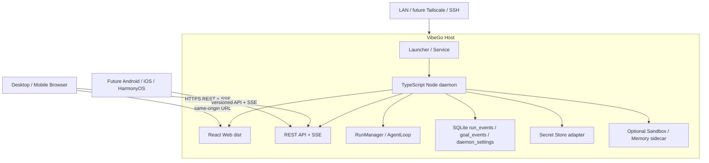

# Spec 41：Host-first 发行、同源 Web 与后续客户端边界

- 状态：Accepted（设计总约束；实现由 [Spec 51](51-host-first-release-and-client-boundary.md) R1–R4 跟踪）
- 日期：2026-08-04
- 适用范围：VibeGo Host、daemon、React Web/PWA、LAN/Tailscale/SSH transport、未来 Android/iOS/HarmonyOS 客户端
- 相关 ADR：[ADR 0010：Host-first 同源 Web 与客户端边界](../adr/0010-host-first-same-origin-web-and-client-boundary.md)

## 1. 背景

VibeGo 的核心运行时始终位于用户自己的开发主机。主机拥有 workspace、模型凭据、
SQLite event log、AgentLoop、Approval、Sandbox 和可选的 TencentDB sidecar；远程设备
的职责是观察和控制这个 Host，而不是复制一套 agent runtime。

当前源码仓库已经具备 daemon 和 React Web，但开发启动仍是两个进程：daemon 提供 API，
Vite 提供 Web。这个方式适合开发，不适合作为最终用户的部署体验。正式发行版必须让
Host 同时提供后端和编译后的 Web，用户在远程设备上直接打开一个 URL 即可使用。

## 2. 目标

### 2.1 必须实现

1. 单个 VibeGo Host 进程提供 API、SSE、静态 React Web 和本地存储。
2. 生产访问默认同源：`/`、`/assets/*`、`/api/v1/*` 和 run SSE 使用同一 scheme、host、port。
3. 远程桌面、手机、平板和折叠屏只需要浏览器，不安装 Node.js、pnpm、Python 或数据库。
4. Windows、macOS、Linux Host 使用同一套 TypeScript daemon 合约和 React Web；平台差异
   收敛在 launcher、路径、进程、证书、secret store 和 sandbox adapter。
5. 未来 Android、iOS、HarmonyOS 客户端只消费版本化 API/SSE，不直接访问 SQLite 或运行
   AgentLoop。
6. 默认 loopback、LAN 显式开启、LAN 默认 TLS、一次性 pairing 和现有 auth/CSRF/Origin
   边界保持不变。
7. 保留 Tailscale、SSH、反向代理等后续 transport 的接入点，但不在 Host-first MVP 中
   隐式开启公网访问。
8. 发行包可以在没有系统 Node.js 的机器上启动，并能进行签名更新和可恢复回滚。

### 2.2 不在本规格内

- 当前阶段不实现 Android、iOS 或 HarmonyOS 原生客户端；
- 不为每一种设备维护另一套业务后端或 agent loop；
- 不要求 Electron；它会增加常驻资源和发行复杂度；
- 不默认启用 UPnP、隐式公网穿透、mDNS 登录或明文公网 HTTP；
- 不让 Web 客户端直接读写 Host 文件系统、SQLite、模型 key 或 sidecar 目录；
- 不把完整 TencentDB、Docker、Python 或第二套 scheduler 打进 daemon 主进程。

## 3. 术语与边界

| 名称 | 定义 | 权威性 |
| --- | --- | --- |
| Host | 用户主要开发电脑上的 VibeGo 发行包和 daemon | 唯一运行事实源 |
| Web Client | Host 托管的 React Web/PWA，浏览器访问 | 展示和调用 API，不执行 agent |
| Native Client | 后续 Android/iOS/HarmonyOS 客户端 | 与 Web 使用同一 API，不拥有状态 |
| Transport | loopback、LAN、未来 Tailscale/SSH/反向代理 | 只改变连接路径，不改变权限 |
| Control Plane | pairing、device session、settings 和能力查询 | 仍由 daemon 负责 |
| Execution Plane | AgentLoop、Scheduler、Approval、Sandbox、Workspace | 只在 Host 运行 |

## 4. 目标架构

生产环境的 Web 静态资源由 daemon 提供。开发环境可以继续使用 Vite 独立端口，但必须
通过显式 dev proxy 或 CORS fixture 连接 daemon；开发端口不是发行版部署合约。

## 5. 同源 Web 合约

### 5.1 路由

daemon 发行模式必须提供：

| 路径 | 行为 |
| --- | --- |
| `GET /` | 返回版本化 React `index.html` |
| `GET /assets/*` | 只读取发行包内静态资源，禁止目录遍历和目录列表 |
| `GET /health` | 返回 transport/storage/auth 能力摘要，不代表模型或工具已可用 |
| `/api/v1/*` | 现有认证 API、settings、workspace、Goal 和 run API |
| run SSE | 使用现有 seq/Last-Event-ID resume 合约 |
| 未知 Web 路径 | 对 SPA 路由返回受限 `index.html`；API 路径不得 fallback |

必须满足：

- Web 生产构建不依赖 `VITE_READY4VIBE_API_BASE_URL`；默认使用同源相对路径；
- 不需要生产 CORS；Origin/CSRF 仍由现有 AuthGate 校验；
- hashed assets 可以长期缓存，`index.html` 必须短缓存或 no-cache；
- 静态文件错误不得泄露 Host 绝对路径；
- Web 版本和 API contract version 可以独立检查，旧 Web 不得静默调用未知 API。

### 5.2 开发与发行模式

| 模式 | Web | daemon | 目的 |
| --- | --- | --- | --- |
| `dev` | Vite 独立端口 | Node daemon 独立端口 | 快速前端开发；使用显式 proxy/allowed origin |
| `preview` | 构建后的静态文件 | Node daemon | 本地验收同源行为 |
| `release` | daemon 内置 `web/dist` | 内置 Node runtime 的 Host | 用户发行版唯一推荐路径 |

根目录必须最终提供一个统一的开发/预览入口；发行版不得要求用户启动两个终端。

## 6. Host 发行与跨平台要求

### 6.1 发行目标

第一阶段构建矩阵：

| Host | 架构 | 目标产物 |
| --- | --- | --- |
| Windows | x64、ARM64 | MSI 或 ZIP + launcher |
| macOS | Intel、Apple Silicon | DMG / `.app` |
| Linux | x64、ARM64 | AppImage 或 tarball |

发行包携带编译后的 daemon、React Web、Node runtime 和版本 manifest。用户不应依赖
系统 Node/pnpm。单文件二进制（例如 Node SEA）可以后续评估，不能阻塞第一版发行包。

### 6.2 数据目录与 secret

非 secret 设置继续使用版本化 `daemon_settings` 和 SQLite。运行时必须提供平台数据目录
解析器：

- Windows：`%LOCALAPPDATA%\\VibeGo`；
- macOS：`~/Library/Application Support/VibeGo`；
- Linux：`$XDG_STATE_HOME/vibego`，没有时使用 `~/.local/state/vibego`。

模型 API key、证书私钥和未来设备 refresh token 通过平台 secret store adapter 保存：

- Windows Credential Manager/DPAPI；
- macOS Keychain；
- Linux Secret Service/libsecret。

没有可用 secret store 时只能降级为进程内存，并明确提示重启后需要重新配置；不得写入
浏览器存储、普通 settings、events、logs、URL 或 sidecar revision。

### 6.3 启停和更新

Launcher/Service 负责：

1. 创建数据目录；
2. 启动 daemon；
3. 选择空闲端口并显示最终 URL；
4. 自动打开本机浏览器；
5. 处理 graceful shutdown；
6. 在更新时停止旧进程、切换版本并恢复；
7. 启动失败时保留旧版本并给出稳定错误码。

更新必须下载签名发行包，校验 manifest/checksum/signature，在不可变版本目录中验证后
切换；失败时回到 previous。不得原地覆盖正在运行的版本。

## 7. 首次引导与远程使用

1. Host 默认 loopback，不自动打开 LAN。
2. 本机浏览器打开 Host Web，完成一次 pairing。
3. 设置向导配置模型、workspace、默认 trust、approval、sandbox 和 limits。
4. 用户在本机 Web 中显式开启 LAN；没有有效 TLS 时 fail-closed。
5. Host 显示访问 URL、证书状态和短时一次性 QR/pairing code。
6. 远程浏览器扫码或输入 URL，完成设备 pairing；二维码不得携带长期 Bearer token。
7. 远程设备只通过 REST/SSE 使用 Host；Host 必须保持运行并由网络/防火墙允许访问。

证书向导可以先支持用户提供的证书和明确的本地开发证书；ACME/Let's Encrypt、Windows
证书存储和公网反向代理是后续 adapter。公网暴露永远不因打开 LAN 而自动发生。

## 8. Native Client 后置边界

原生客户端是后续阶段，不进入当前 Host-first MVP 的验收范围。为了保证未来兼容，当前
daemon 必须遵守：

- 所有公共 REST API、SSE event、error code、capability 和 settings response 版本化；
- 原生客户端只能使用 `/api/v1`、SSE resume 和受认证的 pairing/device session；
- 原生客户端不得读 SQLite、事件文件、workspace root 或 memory sidecar；
- native UI 不得复制 AgentLoop、Scheduler、Approval 或 Sandbox 状态机；
- 客户端声明类型/版本只用于兼容性和诊断，不得成为权限提升条件；
- 移动端后台不能保持 SSE 时，使用 run snapshot + `after` cursor 恢复，不要求第二套事件流；
- 设备撤销、OS secure storage、离线缓存和通知属于 Native Client spec，不提前塞入 Web。

后续客户端顺序建议为：

1. 先稳定 Web/API/SSE 合约；
2. 再提供 TypeScript client SDK 和 contract fixtures；
3. 先做 Android/iOS/HarmonyOS 的只读 run/approval/Goal 体验；
4. 最后再增加原生推送、后台任务和平台文件选择器。

## 9. 安全和资源门禁

- 默认启动只绑定 loopback；LAN 必须显式开启并默认 TLS；
- pairing code 一次性、短时有效，Bearer token 不进入 URL；
- Web 同源不等于免认证，所有受保护 API 继续经过 AuthGate；
- Host 不因为客户端是 native 就绕过 CSRF、device session 或 Approval；
- 没有 Docker/Podman 时，external-sandbox 和 shell 继续 fail-closed；
- Web 静态资源、SSE、event replay 和日志都必须有 bounded size；
- 不为“全平台”引入 Python、Redis、PostgreSQL 或常驻浏览器服务；
- 前端和 native client 都不能成为第二个执行事实源。

## 10. 分阶段退出条件

### Phase 40a：同源 Web

- daemon 可托管 Web `dist`；
- `/`、`/assets`、`/api`、SSE 同源；
- SPA fallback、缓存、路径遍历和错误响应有测试；
- preview smoke test 可在一个进程/一个 URL 中完成。

### Phase 40b：Host launcher 与发行包

- Windows/macOS/Linux 构建矩阵；
- 不依赖系统 Node/pnpm；
- 自动打开浏览器、数据目录初始化、graceful shutdown；
- 签名 manifest、current/previous 更新和失败回滚。

### Phase 40c：LAN 引导

- 本机 Web 显式开启 LAN；
- 证书状态、URL、QR 和 pairing code 有 bounded UI；
- LAN 无证书 fail-closed；
- 至少覆盖 Windows 与一个 Unix 平台的真实 smoke test。

### Phase 40d：Native Client（后置）

- 只有在 40a–40c 稳定后开始；
- 先完成 SDK/contract fixtures，再写 Android/iOS/HarmonyOS UI；
- 不改变 Host 的 AgentLoop、Goal、run_events、goal_events、Scheduler、Approval 或 Sandbox 权威地位。

## 11. 验收定义

“开箱即用”必须至少意味着：

1. 用户安装一个 Host 包，不安装 Node/pnpm；
2. 启动一次后自动打开一个 URL；
3. 本机浏览器能完成 pairing、模型配置、workspace 配置和首个 run；
4. 远程浏览器只输入 URL 或扫码即可接入；
5. Web、API、SSE 不需要用户配置跨域代理；
6. LAN 默认关闭，启用后无 TLS 不能启动；
7. daemon 重启后非 secret 设置和事件可恢复；
8. memory、sandbox、Docker、模型 provider 不可用时有清晰降级，不阻塞基础 Web；
9. 安装包可更新、失败可回滚；
10. 原生客户端尚未实现不会影响 Web Host 的完整使用。
