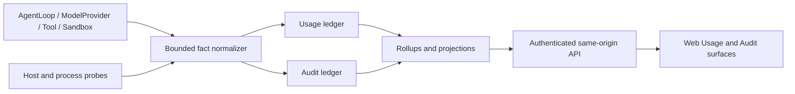

# Spec 43：资源、Token、费用与审计可观测性

- 状态：Phase 43a/43b 已实现；collector/audit adapter 由 Spec 44-R4 提供（API、UI 后置）
- 日期：2026-08-04
- 适用范围：Host daemon、React Web、SQLite、AgentLoop 运行记录和后续原生客户端 API
- 相关：[Spec 03：模型与上下文契约](03-model-context-contract.md)、[Spec 38：Conversation-first Web shell](38-conversation-first-web-shell.md)、[Spec 41：Host-first 发行与客户端边界](41-host-first-distribution-and-client-boundary.md)、[Spec 42：shadcn 风格 Web 设计系统](42-shadcn-style-web-design-system.md)
- 相关 ADR：[ADR 0012：本地资源与费用审计账本](../adr/0012-local-resource-and-cost-audit-ledger.md)

## 1. 背景与目标

VibeGo 既是开发工具，也是用户长期运行在主机上的本地 Agent Host。当前已有 `run_events`
和 `model.usage` 事件，可以知道一次 run 的部分模型 token，但还不能回答下面这些问题：

- Agent、工具进程和 sandbox 实际消耗了多少 CPU、内存和磁盘；
- 一次 run、一个 turn、一次模型请求分别消耗了多少 token，哪些是 provider 报告的，哪些是估算的；
- 当前模型价格版本是什么，费用是精确值、估算值还是未知；
- 并发 run 是否互相争抢资源，失败/重试是否造成重复计数；
- 用户修改模型、审批、sandbox、workspace 或远程访问设置的时间和结果；
- 数据是否被截断、采样是否丢失、费用是否因为缺少价格而无法计算。

本 Spec 同时服务两个目的：

1. **开发优化**：定位慢 run、模型等待、工具瓶颈、内存增长、磁盘耗尽和并发争用；
2. **用户透明度**：让用户在 Web 中看到资源、token、费用、准确度、保留周期和审计记录，
   不需要猜测或手工读取 SQLite。

本阶段只设计可落地的本地 bounded observability 能力，不引入必须常驻的 Prometheus、
Grafana、Langfuse、LiteLLM proxy 或 OpenTelemetry Collector 服务。

## 1.1 Phase 43a 冻结范围

Phase 43a 只建立 ready4vibe 原生、版本化的资源/usage/audit/pricing contracts，以及一个
不连接采样器、SQLite、AgentLoop 或 Web 的纯模型 usage replay projection。该阶段的目标是
先把单位、精度、隐私和幂等语义固定下来，避免后续 collector 或 API 在不同模块各自解释
token/费用。

Phase 43a 的纯 projection 只消费已有 `StoredEvent[]` 中的 `run.created`、`turn.started`、
`model.requested`、`model.usage`、`model.completed`、`model.error`、`run.failed`、
`run.cancelled` 和 `run.needs_recovery` 事件；它按 `seq` 重放、生成稳定的 derived usage
records 和 checksum。事件里没有 provider 报告的字段时，projection 必须保留
`unknown`，不能用零填充或伪造成本。它不会把 prompt、transcript、tool output、命令、路径
或 secret 带入 projection。

本阶段明确不做：`resource_samples`/`usage_ledger`/`audit_events` SQLite 表、host/tool/
sandbox collector、pricing settings、daemon API、SSE、Web Usage 页面和任何 run admission
改动。interactive run、Goal Control、`run_events`、`goal_events`、AgentLoop、Scheduler、
Approval、Sandbox 与 WorkspaceRegistry 行为必须保持原样。

## 1.2 Phase 43b 冻结范围

Phase 43b 在 `packages/observability` 保留纯的 batch/rollup port，在
`packages/storage` 提供 `InMemoryObservabilityLedger` 和 `SqliteObservabilityLedger`。两者
都使用独立的 `resource_samples`、`usage_ledger`、`audit_events`、`usage_rollups` 表/集合；
不读取或改写 `run_events`、`goal_events` 或 `daemon_settings` 的行。SQLite 写入统一使用
`BEGIN IMMEDIATE`，同一 ID + 相同 canonical 内容是 no-op，不同内容是 conflict，跨资源的
batch 在任一失败时整体回滚。

Audit draft 由 ledger 分配全局 `appendSequence`、前 hash 和当前 hash；append 前验证 hash
chain，replay/verify 失败必须 fail-closed。rollup 只由 bounded usage/sample/audit records
重建，当前只冻结 UTC hour token/resource/event 计数和 unknown 维度，货币 pricing 留给
Phase 43d。cleanup 只允许删除 samples/rollups，不能提供清空 usage/audit 的快捷路径。

Phase 43b 仍不接入 collector、AgentLoop observer、daemon API、SSE、Web 或任何 interactive
run admission；失败只影响 ledger 调用方，不改变模型、工具、审批或 sandbox 结果。

## 2. 事实源与边界

资源观测、使用量计数、审计事件和派生报表是四种不同的数据，不得混为一张“万能日志表”：

| 数据类 | 事实源 | 用途 | 可重建性 |
| --- | --- | --- | --- |
| Run/model/tool 生命周期 | `run_events` | AgentLoop、SSE、run 回放 | 权威、不可篡改 |
| Resource samples | daemon/adapter 采样器 | CPU、内存、磁盘时间序列 | 有限保留、可丢样本但必须计数 |
| Usage ledger | model/tool/sandbox 归一化记录 | token、延迟、费用归因 | append-only，支持幂等重放 |
| Audit ledger | application service 操作 | pairing、设置、审批、导出和拒绝记录 | append-only，支持完整性验证 |
| Rollups/projections | 从以上数据派生 | Web 汇总和趋势图 | 可删除、可重建 |

必须保持以下边界：

- 不修改 `run_events`、`goal_events` 的事实源职责；Goal Control 不能读取或写入本域的内部表来
  绕过 `RunManager`、Scheduler、Approval、Sandbox 或 WorkspaceRegistry；
- 不修改 AgentLoop 核心状态机。优先消费已有 `model.usage` 和 run 终态事件，并在 daemon
  application service 层增加 observer/ledger adapter；
- 资源采样不能阻塞模型、工具、审批、SSE 或 run 终态。队列满时丢弃采样并增加
  `droppedSampleCount`，不能静默当作零；
- interactive run 不得因为费用未知、采样器不可用或达到展示阈值而被静默拒绝；警告和 quota
  是后续显式策略，不能替代现有安全门禁；
- 原生 Android/iOS/HarmonyOS 客户端后置，只消费版本化 REST/SSE projection，不直接读取 SQLite。



## 3. 统一精度、单位和隐私规则

### 3.1 精度必须显式

所有数值都带有 `accuracy`：

- `reported`：provider 或操作系统直接报告；
- `measured`：由本机采样器测量；
- `estimated`：由 tokenizer、时间差或平台 fallback 估算；
- `unknown`：无法安全获得，不能显示为 `0`；
- `not-applicable`：该 provider/runtime 不支持该维度。

Web 必须同时显示数值和精度徽标，例如“12,430 tokens · reported”“¥0.18 · estimated”或
“sandbox CPU · unknown”。汇总中如果存在 unknown，必须显示覆盖率和未知数量。

### 3.2 单位和 JSON 表示

- token 是非负整数；
- CPU 使用 `milliPercent`（100000 = 100%）和可选的 `cpuTimeMs`；
- 内存、磁盘和 I/O 使用字节计数；
- 费用使用 `amountMicros` 和 `unitMicrosPerMillionTokens`，金额以十进制字符串传输，避免
  JavaScript 浮点误差；
- 时间统一为 ISO 8601 UTC；可选单调时钟值只用于同一进程内排序，不作为跨重启事实；
- 所有计数有上限和 `schemaVersion`，超过上限 fail closed；
- `runId`、`turnId`、`requestId`、`callId`、`workspaceId` 只作为 opaque ID，不能从中推导路径或
  secret。

### 3.3 隐私和脱敏

任何 resource/usage/audit projection 都禁止写入：API key、token、cookie、Authorization、环境变量、
完整 prompt/transcript、原始 provider response、完整 tool output、命令行参数、workspace 绝对路径、
文件名列表和未脱敏的远端 IP。

允许写入的安全字段是 bounded 的 provider/model/tool/sandbox 标识、字节数、时长、状态、错误码、
opaque ID、传输类型（loopback/LAN/Tailscale/SSH）和经过白名单的设置变更摘要。磁盘只显示
`system-volume`、`workspace-volume` 或稳定随机 `volumeId`，不显示 `C:\`、`/Users` 等路径。

## 4. Contract 草案

最终 Zod contract 放入 `packages/contracts`，版本命名为 `resource-usage/v1`、`audit/v1`，并
拒绝未知字段和 secret-shaped 字段。

### 4.1 ResourceSample

```text
ResourceSample {
  schemaVersion: 1
  sampleId: opaque idempotency key
  sampledAt: ISO time
  scope: host | daemon | run | tool-process | sandbox
  runId?: opaque id
  turnId?: opaque id
  source: node | os-adapter | sandbox-adapter
  accuracy: measured | estimated | unknown
  cpu?: { milliPercent: uint, cpuTimeMs?: uint }
  memory?: { rssBytes?: uint64-string, heapUsedBytes?: uint64-string,
             externalBytes?: uint64-string, hostAvailableBytes?: uint64-string }
  disk?: { volumeClass: system-volume | workspace-volume | sandbox-volume,
           volumeId?: opaque id, capacityBytes?: uint64-string,
           freeBytes?: uint64-string, readBytes?: uint64-string, writeBytes?: uint64-string }
  samplingIntervalMs: uint
  droppedSampleCount: uint
}
```

### 4.2 ModelUsageRecord

```text
ModelUsageRecord {
  schemaVersion: 1
  usageId: idempotency key
  runId: opaque id
  turnId: opaque id
  requestId: opaque id
  providerId: bounded id
  model: bounded id
  requestModel?: bounded id
  pricingModel?: bounded id
  dataSource: provider-usage | run-event | session-import | reconciled
  attempt: positive integer
  startedAt: ISO time
  completedAt?: ISO time
  latencyMs?: uint
  timeToFirstByteMs?: uint
  status: completed | failed | cancelled | timed-out | unknown
  tokens: {
    input?: uint, output?: uint, cachedInput?: uint,
    cacheCreation?: uint, reasoning?: uint, toolInput?: uint, toolOutput?: uint,
    audioInput?: uint, audioOutput?: uint,
    acceptedPrediction?: uint, rejectedPrediction?: uint
  }
  inputTokenSemantics: fresh | cache-inclusive | unknown
  tokenAccuracy: reported | estimated | unknown
  reconciledFrom?: opaque usage ids
  cost?: { currency: bounded ISO code, amountMicros: decimal string,
           accuracy: exact | estimated | unknown, pricingRevision: bounded id,
           costMultiplier?: decimal string, items?: CostItem[] }
  sourceRevision?: bounded provider revision
}

CostItem {
  itemCode: input | output | cache-read | cache-write | reasoning | audio | flat-fee | other
  quantity?: uint
  unitMicrosPerMillionTokens?: decimal string
  subtotalMicros: decimal string
  tierBreakdown?: [{ upTo?: uint, units: uint, subtotalMicros: decimal string }]
}
```

同一 `usageId` 和相同内容是 no-op；相同 ID 内容不同返回 conflict。重试的每个 attempt 都保留，
逻辑请求汇总必须同时给出 `attemptCount`，不能把重试 token 静默丢弃或重复计入一次 attempt。

### 4.3 Tool/Sandbox usage

工具和 sandbox 只记录 `toolId`、版本、风险级别、运行时长、成功/失败、输出字节数、CPU/memory
峰值和受限的 process/sandbox 类别。不得写入命令字符串、参数、cwd、文件路径或原始输出。若
平台无法提供子进程/Job Object/cgroup 统计，则记录 `accuracy=unknown`，不能把 daemon 总量冒充
工具耗用量。

### 4.4 AuditEvent

```text
AuditEvent {
  schemaVersion: 1
  eventId: idempotency key
  appendSequence: goal-independent monotonic sequence
  at: ISO time
  actor: system | user-session | remote-session
  transport: loopback | lan | tailscale | ssh
  action: bounded allowlisted action
  targetKind: run | model | tool | sandbox | workspace | settings | pairing | export | audit
  targetId?: opaque id
  outcome: allowed | denied | succeeded | failed | degraded
  reasonCode?: bounded code
  correlationId: opaque id
  safeDetails?: bounded allowlisted JSON
  previousHash?: hex hash
  eventHash: hex hash
}
```

`AuditEvent` 只记录“谁在何时对哪个安全对象做了什么、结果如何”，不记录 transcript。每条记录
使用 canonical JSON 计算 hash chain；验证失败时 Web 显示 degraded 并停止声称“完整可信”，但不
阻塞正常 run。

## 5. 采集策略（低资源优先）

### 5.1 daemon/host

优先使用 Node 内建能力和平台 adapter：

- daemon CPU：`process.cpuUsage(previous)` 加墙钟间隔和 CPU 核数归一化；
- daemon memory：`process.memoryUsage()`（RSS、heap、external、arrayBuffers）；
- event-loop health：`performance.eventLoopUtilization()` 和 bounded lag 直方图；
- host memory：`os.totalmem()`/`os.freemem()`；
- host CPU：Node 可用信息或受控 OS adapter；Windows 不把 `os.loadavg()` 的零值当成有效负载；
- disk：优先 `fs.statfs` 或平台文件系统 adapter，只有容量/空闲/读写计数，不返回路径。

### 5.2 tool/sandbox 子进程

工具执行器在 `tool.started`/`tool.completed` 边界采集一次；长任务按采样 profile 追加 bounded
样本。external sandbox 由 Docker/Podman/VM adapter 提供 cgroup/Job Object/VM 统计；
host-restricted 模式仅在可安全取得子进程树时归因，否则标记 unknown。采集器不能自行执行
未授权的 `ps`、PowerShell、shell 或 Docker 命令来“补数据”。

### 5.3 自适应 profile

默认 profile（最终数值待讨论）：

| 状态 | host/daemon | tool/sandbox | 目的 |
| --- | --- | --- | --- |
| idle | 60 秒 | 无 | 几乎零开销的长期趋势 |
| active | 5 秒 | 开始/结束 + 最多 5 秒 | 开发优化和并发观察 |
| detailed（用户显式开启） | 1 秒，最多 15 分钟 | 最多 1 秒 | 短时定位尖峰，明确提示额外开销 |

采样通过 bounded async queue 批量写 SQLite。队列、SQLite 或系统 probe 失败时只产生 degraded
状态和计数，不改变模型/工具结果。daemon 退出前尽力 flush，但不能为了审计无限期阻塞退出。

### 5.4 低资源验收目标

在代表性 Windows/macOS/Linux 主机上实测而不是口头保证：

- idle profile 额外 daemon CPU 平均低于 1%，额外 RSS 低于 16 MiB；
- active profile 在两个并发 run 下额外 CPU 平均低于 2%；
- 采样写入失败或停机恢复不丢失 usage ledger 的幂等性；
- raw sample 默认保留 48 小时，rollup 默认保留 90 天，且均可由用户设置降低；
- `droppedSampleCount`、未知精度和采样覆盖率可在 UI 中查看。

这些是验收预算，不是当前已测结果。

## 6. Token 与费用归因

### 6.1 token 来源优先级

1. provider `usage` 事件或协议响应中的规范字段（reported）；
2. adapter 明确映射的 provider header/metadata（reported）；
3. 使用与当前 model 版本锁定的 tokenizer 对 bounded input/output 做估算（estimated）；
4. 无法安全估算时 unknown。

现有 `model.usage` 事件是首个投影输入；不把 prompt 或原始 response 写入 ledger。provider 只返回
部分 token 时，缺失维度保持 unknown，不能用零填充。

### 6.2 token 维度与缓存语义

Token 不能只保存 `input + output` 两个桶。参考 AxonHub 的成本追踪和 CC Switch 的协议归一化，
至少保留以下独立维度：

| 维度 | 说明 | 计价注意 |
| --- | --- | --- |
| `input` | 未归类的输入/Prompt token | 需要同时记录 `inputTokenSemantics` |
| `output` | Completion/generated token | 通常单独价格 |
| `cachedInput` | 缓存读取/命中 token | 不应再次计入 fresh input |
| `cacheCreation` | 缓存创建 token | 可与 cache read 使用不同价格 |
| `reasoning` | provider 报告的推理 token | 不默认从 output 猜测 |
| `audioInput`/`audioOutput` | 多模态音频 token（后置） | 缺失价格时 unknown |
| `acceptedPrediction`/`rejectedPrediction` | 预测 token（后置） | 由 provider 语义决定 |

`realTotalTokens` 的展示口径为 `freshInput + output + cacheCreation + cacheRead`，并显示缓存
命中率 `cacheRead / (freshInput + cacheCreation + cacheRead)`；未知桶不静默当作零。

不同协议的 `input` 语义必须显式保存：

- `fresh`：input 已排除 cache read/write；
- `cache-inclusive`：input 包含缓存部分，需要按协议扣除后再计价；
- `unknown`：不能安全判断，不进行“看起来精确”的扣除。

只有 cache read 而 input/output 为零的请求仍然是有效的 billable usage，不能因为“全 0 主桶”
被过滤。provider 响应、现有 `model.usage`、未来 session importer 都必须经过同一个归一化器。

### 6.3 PricingCatalog

价格是独立、可版本化、非 secret 的 settings/ledger 数据：

```text
PricingRule {
  pricingRevision: bounded id
  providerId: bounded id
  modelPattern: bounded pattern
  effectiveFrom: ISO time
  currency: ISO code
  inputMicrosPerMillionTokens?: decimal string
  outputMicrosPerMillionTokens?: decimal string
  cachedInputMicrosPerMillionTokens?: decimal string
  reasoningMicrosPerMillionTokens?: decimal string
  source: builtin | user-configured | imported
}
```

价格未配置时 cost 为 unknown，不是 0。价格更新不重写历史 `ModelUsageRecord`；报表可以选择
“按当时 pricingRevision”或“按当前价格重算”，两者必须并列显示。默认不调用 provider 账单 API，
不保存 API key，也不做自动汇率换算；跨币种换算只能使用用户明确导入的带 revision 汇率。

PricingCatalog 至少支持三种模式，不能把所有服务强行归约为单一“每百万 token”价格：

| 模式 | 数据 | 适用场景 |
| --- | --- | --- |
| `flat-fee` | 每次请求或每次 run 固定金额 | 固定套餐/调用费 |
| `per-unit` | 每个 token item 的单价 | 大多数模型 |
| `tiered` | 按区间拆分 `tierBreakdown` | 阶梯折扣或月度额度 |

每条 usage record 保存 `costItems` 和 `pricingRevision`，汇总 `totalCost` 只是明细之和。缓存
读取、缓存创建、reasoning 和 TTL 变体必须能独立展示，避免用户无法解释“为什么总价不同”。

### 6.4 来源、模型归一化与去重

参考 CC Switch 的 proxy/session 双来源经验，本地 VibeGo 仍以 daemon run/provider usage 为首选
来源，但 contract 预留 `dataSource`：

- `provider-usage`：模型 provider 直接报告；
- `run-event`：从现有 `run_events` 的 `model.usage` replay；
- `session-import`：未来显式启用的 CLI/session importer；默认不扫描用户目录；
- `reconciled`：两个来源经过稳定 ID 对账后的 projection。

`requestModel` 是请求中出现的模型名，`pricingModel` 是实际用于匹配价格的规范模型名。价格匹配
前可以做小写、去 provider 前缀、去路由后缀等 bounded normalization，但必须保存规范结果和
规则 revision，不能覆盖原始安全标识。

去重规则：

- provider/message ID、run/request ID 和 session importer 的稳定 message ID 优先生成 `usageId`；
- 相同 ID、相同 usage semantic（模型、缓存语义、token、状态）是 no-op；
- 相同 ID、不同 semantic 返回 conflict；
- 无稳定 ID 时只允许在 usage 有 billable token 时生成一次受命名空间约束的 fallback ID；
- fallback collision 使用 canonical semantic hash 形成独立 ID，并在审计中记录 collision；
- proxy 与 session/import 来源重合时保留一个逻辑 usage，并记录 `reconciledFrom`，不能重复计费。

### 6.5 汇总规则

- run 级 cost = 该 run 所有 attempt 的 cost 总和，并显示 retry count；
- session/day/week rollup 使用 UTC period 和明确 timezone display，不混淆账期；
- fake provider、免费模型或无价格模型显示 `not-applicable`/`unknown`，不伪造“免费”；
- 取消、超时、provider 错误仍保留已经报告的 token 和费用；
- tool/sandbox 成本默认不是货币成本，只有用户配置的外部资源单价才进入 cost，并明确来源。

## 7. SQLite 存储与保留

新增表必须独立于 `run_events`、`goal_events`、`daemon_settings`：

- `resource_samples`：bounded 高频采样，按 sampledAt 分区索引；
- `usage_ledger`：Model/Tool/Sandbox 事实记录，`usageId` 唯一；
- `audit_events`：append-only 安全审计，`eventId` 唯一，hash chain；
- `usage_rollups`：小时/日聚合，可由前三者重建；
- `pricing_rules`：版本化价格和汇率规则，不含 secret。

SQLite adapter 使用 `BEGIN IMMEDIATE`、WAL、bounded batch 和幂等冲突检查。rollup 失败不删除原始
ledger；cleanup 失败返回 degraded 并保留未清理数据。用户可在 Web 中分别删除 samples、rollups
和 usage history；audit 默认只允许按 retention 清理并先导出/校验，不能提供“清空全部日志”快捷键。

## 8. Daemon API 与 Web 体验

### 8.1 API

在现有认证、CSRF、Origin 和 Host-first 同源边界内增加：

```text
GET   /api/v1/usage/summary?range=24h|7d|30d
GET   /api/v1/usage/timeseries?metric=cpu|memory|disk|tokens|cost&range=...
GET   /api/v1/runs/:runId/usage
GET   /api/v1/audit/events?cursor=...&action=...&outcome=...
GET   /api/v1/usage/pricing
GET   /api/v1/settings/observability
PATCH /api/v1/settings/observability
POST  /api/v1/usage/rebuild
POST  /api/v1/audit/verify
POST  /api/v1/usage/export
```

所有列表默认最多 100 项、cursor 分页、bounded 时间范围和稳定错误码。响应只返回 projection，
不返回 raw provider payload、命令、路径或 secret。Usage 页面打开时优先复用现有 run SSE 作为
刷新提示，并以 15–30 秒低频拉取汇总；不新增第二套长连接事件事实源。

### 8.2 conversation-first Web

在 Spec 42 的 shadcn 风格组件体系中增加 `UsageSummary`、`UsageTimeseries`、`CostBreakdown`、
`ResourceHealthCard`、`AuditTimeline` 和 `PricingSettings` 组合组件：

- 对话页 context rail 显示当前 run 的 token、延迟、费用精度和资源峰值；
- 独立 Usage drawer/page 显示 Host 当前 CPU/RSS/disk、活跃 run、模型/工具 breakdown、趋势和
  unknown/dropped coverage；
- Audit timeline 显示 pairing、设置变更、审批、run 终态、provider degraded、导出和完整性校验；
- 费用卡必须区分 reported/estimated/unknown，不用颜色单独表达金额或安全状态；
- 桌面使用三栏密度，竖屏桌面/平板折叠 context rail，手机/折叠屏使用 Sheet 和单列时间序列；
- 用户可以选择 24h/7d/30d、采样 profile、保留周期和价格规则，但不能在 UI 中看到 API key、绝对
  路径或原始 command。

具体 primitive 继续遵守 Spec 42 的“组件库优先”规则；本 Spec 不引入第二套图表框架，趋势图
优先使用已有 shadcn-compatible、可 tree-shake 的轻量组件，若无合适库再记录理由。

## 9. 开源项目参考与复用边界

截至 2026-08-04 对公开仓库和 LICENSE 做了只读检查。这里只借鉴数据模型、语义和运维边界，
不 vendor 完整项目、不复制源代码、不引入 Python runtime 或第二套后端：

| 项目 | 参考内容 | 当前上游许可/边界 | VibeGo 做法 |
| --- | --- | --- | --- |
| [OpenTelemetry Specification](https://github.com/open-telemetry/opentelemetry-specification) | resource attributes、metrics/logs/traces 语义、时间和聚合概念 | Apache-2.0 | 借鉴语义；本地 SQLite collector 不要求 OTel Collector 常驻 |
| [Prometheus node_exporter](https://github.com/prometheus/node_exporter) | CPU、memory、filesystem metric family 和 scrape 思路 | Apache-2.0 | 借鉴指标命名/精度；不把 exporter 作为 daemon 子进程 |
| [cAdvisor](https://github.com/google/cadvisor) | 容器/进程层 CPU、memory、filesystem 归因和峰值 | Apache-2.0 | 由 sandbox adapter 提供可用的 cgroup/Job Object 统计，不复制 cAdvisor |
| [Langfuse](https://github.com/langfuse/langfuse) | trace/generation、token、latency、cost、usage dashboard | MIT（`ee/` 和第三方组件有独立许可） | 借鉴 generation/usage projection；不引入 Langfuse server/SDK 作为硬依赖 |
| [LiteLLM](https://github.com/BerriAI/litellm) | 多 provider usage 归一化和 model pricing 组织方式 | MIT（`enterprise/` 有独立许可） | 借鉴 adapter/pricing 结构；不引入 Python proxy 或替代 ModelProvider |
| [AxonHub](https://github.com/looplj/axonhub) | 输入/输出/缓存读写/reasoning/TTL token 分桶、flat/per-unit/tiered 定价、`costItems`、价格版本引用、按维度 analytics | 通用部分 Apache-2.0；`llm/` 为 LGPL-3.0，部分目录有 NOTICE | 借鉴 token taxonomy、cost item/tier breakdown 和 pricing reference；不复制网关、GraphQL 或实现代码 |
| [CC Switch](https://github.com/farion1231/cc-switch) | proxy 与 CLI session 双来源、稳定 request/message ID 去重、cache-inclusive/fresh 语义、请求明细/趋势/Provider/模型汇总、rollup/prune | MIT | 借鉴来源标记、去重 collision、缓存归一化、TTFT/latency 和用户筛选体验；不扫描用户目录、不引入 Tauri |

如果后续决定 vendor 任一组件，必须重新读取对应版本的 LICENSE/NOTICE、记录 commit、依赖和
SBOM 影响，并在 ADR 中获得单独批准。

## 10. 分阶段实现与测试门禁

### Phase 43a：Contracts 与纯投影

- 建立 ResourceSample、ModelUsageRecord、ToolUsageRecord、AuditEvent、PricingRule、Summary contract；
- 从现有 `run_events` replay model usage，验证 checksum、幂等、unknown/estimated 语义；
- 不接入采样器、不修改 AgentLoop。

实现归属为 `packages/contracts`（Zod schemas）和新的
`packages/observability`（canonical JSON、fingerprint、纯 replay projection）。其中
`ModelUsageRecord.usageId` 是由 run/turn/occurrence 稳定派生的幂等键；相同事件重放不得重复
计费，事件乱序必须先按 `seq` 稳定排序。派生的 provider/model/request 字段只使用事件中
明确存在的 bounded 标识，缺失 token 维度和价格保持 `unknown`。

### Phase 43b：SQLite ledger 与 rollup（已实现）

- 实现独立表、`BEGIN IMMEDIATE`、appendSequence、eventId no-op/conflict、hash chain 和 cleanup；
- InMemory adapter 先于 SQLite adapter；
- 重启、并发 append、批量原子性和从 ledger 重建 rollup 有测试。

### Phase 43c：低资源 collectors

- daemon/host CPU、memory、disk 采样和 adaptive queue；
- tool/sandbox start/end 归因和 Windows Job Object/macOS/Linux 适配边界；
- probe 不可用、队列满、SQLite 慢写、daemon 重启和跨平台 unknown fixture。

### Phase 43d：Token/cost 与 API

- provider usage normalization、pricing revision、exact/estimated/unknown 成本；
- authenticated summary/timeseries/run usage/audit/pricing/settings/export/verify API；
- 不改变 interactive run、Goal、Scheduler、Approval、Sandbox 行为。

### Phase 43e：Web 与优化闭环

- Usage summary、timeseries、cost breakdown、audit timeline 和设置页面；
- 多比例 viewport、键盘、reduced-motion、长时间范围、unknown/degraded/drop 状态；
- 以实测 CPU/RSS/disk growth 结果调整默认 profile 和 retention。

最低测试集合：

- schema 拒绝 secret、绝对路径、未知维度、负数、过大 payload 和未知 action；
- 相同 ID/内容 no-op，不同内容 conflict；hash chain 可验证且篡改 fail closed；
- run/event replay 顺序稳定，重复 usage 不重复计费，retry attempt 可区分；
- reported/estimated/unknown/not-applicable 成本和缺失价格测试；
- 两个并发 run 的 CPU/memory/token/cost 归因不串线；
- collector 不阻塞 run，队列满会增加 dropped count，unsupported platform 返回 unknown；
- retention/cleanup/rebuild/restart/SQLite lock 和 crash recovery；
- API auth/CSRF/Origin/pagination/redaction/export；Web 不显示 secret/path/raw provider response；
- `pnpm typecheck`、`pnpm test`、`pnpm diff:check` 与资源预算 fixture 通过。

## 11. 待用户确认的细节

以下选项不在本 Draft 中擅自决定，进入实现前需要确认：

1. 默认 profile 采用 idle 60 秒、active 5 秒，还是更低开销的 30/10 秒；
2. 费用展示默认货币是 USD、CNY，还是完全跟随每条价格规则；
3. raw sample、usage ledger、audit ledger 和 rollup 的默认保留天数；
4. 是否在第一版实现 external sandbox 子进程精确 CPU/memory，还是先返回 unknown；
5. 是否允许用户导入价格 JSON/CSV，以及是否需要“按当前价格重算历史”按钮；
6. 是否将审计 hash verification 和 JSONL/CSV export 放入第一版 Web。

## 12. 非目标

- 不实现支付、发票、provider 账单 API、自动汇率、团队多租户或云端遥测；
- 不 vendor 完整 OpenTelemetry、Prometheus、cAdvisor、Langfuse 或 LiteLLM；
- 不把 token、原始 transcript、tool output、命令、路径或 secret 写入任何可导出 projection；
- 不新增 scheduler、quota admission、AgentLoop 状态机或 Goal 事件流；
- 不在本阶段实现 Android/iOS/HarmonyOS 原生 Usage UI。
