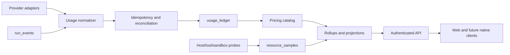

# Spec 44：Provider、Token、费用管理与上游源码复用

- 状态：Accepted for research and design; implementation is gated by the phases below
- 日期：2026-08-04
- 范围：model provider registry、usage/cost normalization、pricing management、audit projections 和开源项目复用
- 相关：
  - [Spec 03：ModelProvider 与 ContextManager 合约](03-model-context-contract.md)
  - [Spec 43：资源、Token、费用与审计可观测性](43-resource-usage-and-cost-audit.md)
  - [ADR 0012：本地资源与费用审计账本](../adr/0012-local-resource-and-cost-audit-ledger.md)
  - [ADR 0013：上游研究与复用边界](../adr/0013-upstream-research-and-provider-management-boundary.md)
  - [开发 Agent 提示词](../prompts/44-provider-usage-management-implementation.md)

## 1. 目标

VibeGo 需要同时解决两个问题：

1. 让模型 provider、token、缓存、延迟、费用和重试可以被统一管理、审计和扩展；
2. 可以学习 CCSwitch、AxonHub、LiteLLM、Langfuse 和 OpenTelemetry 等项目，但不把它们的 proxy、CLI、Tauri、Python runtime 或完整后端带入 VibeGo。

本 Spec 是 Spec 43 的 provider/usage 管理补充，不改变 `run_events`、`goal_events`、AgentLoop、RunManager、Scheduler、Approval、Sandbox 或 WorkspaceRegistry 的事实源地位。

## 2. 上游项目的借鉴点

以下结论是设计输入，不是对当前上游版本的永久承诺。实现前必须按照第 6 节重新读取指定 commit、LICENSE 和 NOTICE。

| 项目 | 借鉴内容 | VibeGo 的原生落点 | 不引入的部分 |
| --- | --- | --- | --- |
| [CC Switch](https://github.com/farion1231/cc-switch) | proxy 与 CLI/session 双来源、稳定 request/message ID、去重冲突、cache-inclusive/fresh 语义、Provider/Model/时间范围汇总、TTFT/latency | `dataSource`、`usageId`、`reconciledFrom`、`inputTokenSemantics`、rollup query | Tauri 应用、用户目录扫描、第二套 proxy、原始 session 文件格式 |
| [AxonHub](https://github.com/looplj/axonhub) | input/output/cache/reasoning/TTL token 分桶、flat/per-unit/tiered 定价、cost item 明细和 pricing revision | `ModelUsageRecord.tokens`、`CostItem`、`PricingRule`、`pricingRevision` | 网关、GraphQL、其后端运行时和未核验的内部协议 |
| [LiteLLM](https://github.com/BerriAI/litellm) | 多 provider 的 capability/usage/pricing 归一化思路 | `ProviderDescriptor`、独立 normalizer 和 pricing adapter | Python proxy、隐式重试、替换 `ModelProvider` |
| [Langfuse](https://github.com/langfuse/langfuse) | generation、latency、token、cost 的投影和筛选体验 | daemon 本地 projection、同源 REST、Web Usage/Audit | 常驻 SaaS/server、完整 transcript 采集 |
| [OpenTelemetry Specification](https://github.com/open-telemetry/opentelemetry-specification) | resource、metric、timestamp、attribute 和聚合语义 | bounded resource sample 和 accuracy 标签 | 强制 OTel Collector、外部 exporter 和高频 trace |

如果用户所说的 `axonhub/ccswitch` 与上表 URL 不一致，开发 agent 必须先确认 canonical repository；不能静默把一个未经确认的仓库当作事实来源。

## 3. 目标架构



### 3.1 Provider registry

后续实现应增加可扩展的 `ProviderDescriptor`/registry，但不让 AgentLoop 识别具体 provider：

- `id`、显示名、协议类型、endpoint policy 和 capability 都是 bounded metadata；
- `ModelProvider` 仍是运行时注入接口，adapter 负责协议转换；
- auth 使用 `authRef`/secret store，descriptor、settings response、event 和 usage ledger 不保存 API key；
- provider 切换只影响新 run；运行中的 run 冻结 provider、model、pricing revision 和 capability snapshot；
- provider 不能绕过 Scheduler、Approval、Sandbox 或 Workspace；
- provider-specific headers、路径和 usage 字段由 adapter 显式声明，不能依赖字符串拼接或隐式 `/chat/completions`。

### 3.2 Usage normalizer

所有来源必须先转换为 Spec 43 的 `ModelUsageRecord`，再进入 ledger：

- 直接 provider usage：`dataSource=provider-usage`；
- `run_events` replay：`dataSource=run-event`；
- 用户显式导入：`dataSource=session-import`；
- 双来源核对：`dataSource=reconciled`，保留 `reconciledFrom`；
- 缺失字段必须保留 `unknown`，不能填 0；
- 每个 retry attempt 单独计数，逻辑请求必须展示 `attemptCount`；
- 同一 `usageId` 和相同 canonical 内容是 no-op；相同 ID 内容不同必须返回 conflict；
- 无稳定 ID 时才允许使用 bounded semantic fingerprint，并记录 collision/降级原因。

### 3.3 Token 和费用

最小 token taxonomy 为：

`input`、`output`、`cachedInput`、`cacheCreation`、`reasoning`；多模态 provider 可扩展 `audioInput`、`audioOutput`、`acceptedPrediction`、`rejectedPrediction`。

必须显式保存：

- `inputTokenSemantics`：`fresh`、`cache-inclusive` 或 `unknown`；
- `tokenAccuracy`：`reported`、`estimated` 或 `unknown`；
- `pricingModel` 与 `requestModel` 的区别；
- `pricingRevision`、货币和每个 `CostItem`；
- flat、per-unit、tiered 三种定价模式；
- 价格缺失时 cost 为 `unknown`，绝不能伪造为 0。

### 3.4 资源和审计

- `resource_samples`、`usage_ledger`、`audit_events` 和 rollup 必须是独立 bounded context；
- 采样队列满、probe 不可用或 projection 失败只能产生 degraded/unknown，不能阻塞 interactive run；
- audit 只记录 actor、transport、action、target、outcome、reasonCode 和 hash chain，不记录 prompt、transcript、command、cwd、绝对路径或 secret；
- raw sample、ledger、rollup 和 audit 的 retention 可分别配置，清理前允许导出和完整性验证；
- Web 和后续 Android/iOS/HarmonyOS 只消费版本化 projection，不直接读取 SQLite。

## 4. 源码学习与复用门禁

### 4.1 研究步骤

开发 agent 必须按以下顺序做，并把结果写入 tracked 文档 `docs/research/upstream-provider-usage.md`：

1. 在 `.research/upstream/<slug>` 中 clone，`.research/` 已被 `.gitignore` 排除；
2. 固定 commit、记录 clone 时间、仓库 URL、默认分支和许可证；
3. 先读根目录 README、LICENSE、NOTICE、贡献指南和构建 manifest；
4. 用 `rg` 定位 token、usage、cache、pricing、dedup、session、rollup、prune、TTFT、latency；
5. 只读取与目标能力直接相关的文件，记录“文件路径 + commit + 观察到的语义”，不复制源码到仓库；
6. 对每个拟复用片段写明许可证、版权声明、依赖和是否需要 NOTICE；
7. 如果仓库、路径、许可证或语义无法确认，停止实现并在研究文档标记 `blocked`。

Windows PowerShell 示例：

```powershell
$researchRoot = Join-Path $PWD '.research/upstream'
New-Item -ItemType Directory -Force $researchRoot | Out-Null
git clone --filter=blob:none --no-checkout https://github.com/farion1231/cc-switch (Join-Path $researchRoot 'cc-switch')
git -C (Join-Path $researchRoot 'cc-switch') log -1 --format='%H%n%ad%n%s' --date=iso
git -C (Join-Path $researchRoot 'cc-switch') sparse-checkout init --cone
git -C (Join-Path $researchRoot 'cc-switch') sparse-checkout set README.md LICENSE NOTICE src docs
rg -n -i 'token|usage|cache|pricing|dedup|session|rollup|prune|ttft|latency' (Join-Path $researchRoot 'cc-switch')
```

命令中的仓库 URL、目录和分支只是示例；agent 必须用实际 canonical repository 和实际存在的路径替换，并记录证据。

### 4.2 复用决策矩阵

| 输入 | 默认决定 | 必须满足的额外条件 |
| --- | --- | --- |
| 设计思想、数据语义、测试场景 | 允许重新实现 | 记录出处和差异，不复制表达性文字或 UI |
| MIT/BSD/ISC/Apache-2.0 的小型独立工具代码 | 有条件允许 | 核对当前 commit、保留版权/NOTICE、依赖兼容、增加 provenance 注释和测试 |
| LGPL/GPL/AGPL 代码 | 默认不复制 | 先做许可证评审；优先 clean-room 重写或隔离为独立进程/包 |
| 未知许可证、生成文件、私有协议、品牌资源 | 禁止复制 | 只能借鉴公开语义，不能 vendor |
| 完整 proxy、CLI、Tauri、Python runtime、server | 禁止引入 | 只实现 VibeGo 原生 TypeScript/SQLite adapter |

即使许可证允许复制，也不得把上游模块直接接入 AgentLoop 的核心循环、默认 run 创建路径或第二套事实源。小段代码复用必须在 ADR 中列出来源、commit、许可证、文件路径和删除/替换计划。

## 5. 分阶段实施

| 阶段 | 内容 | 退出条件 |
| --- | --- | --- |
| 44-R0 | 上游源码、许可证和路径证据 | `docs/research/upstream-provider-usage.md` 完成；未知项明确列出 |
| 44-R1 | `ProviderDescriptor`、registry、usage normalizer contract | provider contract tests、secret/path redaction、capability snapshot tests |
| 44-R2 | 独立 `usage_ledger`、dedup/reconcile、UTC rollup | SQLite/InMemory 一致、idempotency conflict、retry attempt 和重启测试 |
| 44-R3 | pricing catalog 与 cost engine | flat/per-unit/tiered、pricing revision、unknown cost 和历史重算测试 |
| 44-R4 | host/tool/sandbox resource collector 与 audit hash chain | Windows/macOS/Linux adapter fixture、队列降级、完整性验证和 retention 测试 |
| 44-R5 | authenticated API、Web Usage/Audit、export/import | UI 只消费 projection；显式导入；不扫描用户目录；移动端契约稳定 |

44-R1 至 44-R5 应复用 Spec 43 的 contracts，不得另造一套 token 或 cost 类型。任何 phase 都必须先更新 Spec、ADR、implementation-status，再修改代码。

## 6. 测试与验收

- 同一 provider/message/request 的重复上报不重复计费；不同语义返回 conflict；
- cache-inclusive、fresh、cache read/write、reasoning 缺失字段不会被静默归零；
- retry 的每个 attempt 保留，取消、超时、HTTP 错误和部分流的已报告 token 不丢失；
- 价格未配置、provider 不支持、平台无法测量时显示 `unknown/not-applicable`；
- usage/采样/rollup/audit 失败不阻塞 interactive run，也不改变 Goal admission；
- 不允许 API key、Authorization、环境变量、完整 prompt/transcript、tool output、命令和绝对路径进入 ledger、projection、日志、Web 或导出；
- 研究目录不进入 Git；tracked research 只含 commit、路径、许可证、语义摘要和 provenance；
- `pnpm typecheck`、`pnpm test`、`pnpm diff:check` 和 Markdown 链接/code fence 检查通过。

## 7. 当前状态

截至 2026-08-04，Spec 43 的 contracts/纯 projection 已完成，Phase 43b ledger/rollup 的冻结范围与实现状态以 `docs/specs/43-resource-usage-and-cost-audit.md` 和 `docs/implementation-status.md` 为准；resource collector、pricing engine、认证 API 和 Web 仍是后续阶段。Spec 44 先冻结研究和复用门禁，不能把“已写入设计文档”当作“已接入运行时”。
